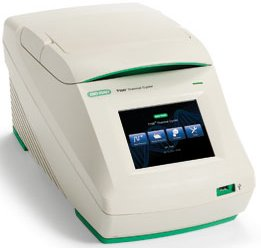

[![[EGB24-20240705161734646.jpeg|698]]](https://www.instagram.com/spettsart/?hl=en)

## Design of the pTAx cloning vectors
### Background

In the [mec](https://metabolicengineeringgroupcbma.github.io/) research group, we are interested in understanding and engineering the biosynthesis of fatty acids and related products by the unicellular fungi known as baker's yeast [Saccharomyces cerevisiae](https://en.wikipedia.org/wiki/Saccharomyces_cerevisiae).

Genetic engineering of complex traits require the simultaneous deletion and/or expression of multiple genes. This is a challenging problem as genetic engineering is time consuming. To solve this problem, we developed a protocol for the assembly of metabolic pathways that we call the **[[The Yeast Pathway Kit\|Yeast Pathway Kit]]** (see our [publication](https://pubmed.ncbi.nlm.nih.gov/26916955) in *ACS Synthetic Biology*). We use this protocol for construction and expression of large metabolic pathways in baker's yeast _[S. cerevisiae](https://en.wikipedia.org/wiki/Saccharomyces_cerevisiae)_ such as [this](https://www.sciencedirect.com/science/article/pii/S221403012300007X) heterologous fatty acid synthesis pathway. Read more about the Yeast Pathway Kit [[The Yeast Pathway Kit\|here]].

The first part of the protocol is assembling a **single gene expression cassette** or **TU** (transcriptional unit). Briefly, single genes are cloned between a promoter and a terminator by _in-vivo_ homologous recombination as in Figure 1 below:

#### Figure 1
![[TU_plasmid_yeast_pathway_kit.png]]

The three linear fragments (**promoter**, **gene** and **terminator** are typically PCR products while the long, curved fragment is a **linearized plasmid**. This plasmid is important since it provides elements for **replication** and **selection** in both *E. coli* and _S. cerevisiae_. The first plasmid we used for this purpose was called pYPKpw and it has the following functional parts (Table#1):

| Table#1 | part                                                                                       | function                                                                                                                                                   |
| ------- | ------------------------------------------------------------------------------------------ | ---------------------------------------------------------------------------------------------------------------------------------------------------------- |
|         | [ampR](https://en.wikipedia.org/wiki/Beta-lactamase)                                       | [selection marker](https://en.wikipedia.org/wiki/Selectable_marker) for *E. coli*                                                                          |
|         | [pUC](https://en.wikipedia.org/wiki/PUC19)                                                 | [origin of replication](https://blog.addgene.org/plasmid-101-origin-of-replication) for *E. coli*                                                          |
|         | [2µ](http://www.sci.sdsu.edu/~smaloy/MicrobialGenetics/topics/plasmids/yeast-plasmid.html) | multicopy origin of replication for _S. cerevisiae_ from the natural [2µ plasmid](https://www.sciencedirect.com/science/article/abs/pii/S0147619X13000292) |
|         | [URA3](https://en.wikipedia.org/wiki/URA3)                                                 | [selection marker](https://en.wikipedia.org/wiki/URA3) for for _S. cerevisiae_                                                                             |
|         | ΔCRP                                                                                       | a **partial, inactive** *E. coli* cyclic AMP receptor protein or [CRP](https://en.wikipedia.org/wiki/CAMP_receptor_protein) gene                           |

The ΔCRP gene is inactive and only provide a recombination site for the promoter and terminator. The pathways that we make are functional in _Saccharomyces cerevisiae_, but we often need to **transfer the pathway to _E. coli_** so we can obtain larger amounts of higher quality DNA for analysis or transformation. The pUC origin of replication (ORI) results in a **high copy number** of the vector in *E. coli*. We have observed genetic **instability** in *E coli* for large pathways that we suspect is linked to high copy number.
### pTAx vectors

We conceived a series of plasmid vectors called pTAx where x is a number from 1 to 11 (at the moment) made from five functional elements (Table #2). Each element is a distinct segment from a particular source plasmid. The pTAx vectors are similar, but differ in the selection markers and yeast ORI.

We typically assemble pTA plasmids from five PCR products, see ([[pTAx assembly strategy]]). The pTAx plasmids should have a lower copy number in *E. coli* than pUC based plasmids since they have the pBR origin of replication including the [ROP](https://en.wikipedia.org/wiki/Rop_protein) gene.

| Table#2 | Name      | _E. coli_ marker | _E. coli_ ORI | yeast ORI | yeast marker | MCS  | Constructed by:           | Enzyme                    | 🥶 freezer list numbers | Sequenced? | Date       |
| ------- | --------- | ---------------- | ------------- | --------- | ------------ | ---- | ------------------------- | ------------------------- | ----------------------- | ---------- | ---------- |
|         | pTA1      | ampR             | pBR           | 2µ        | LEU2         | ΔCRP | Tatiana Pozdniakova       | AatII, ZraI, FspAI        | µ828, µ928, µ929        | ✅          | 2019-10-xx |
|         | pTA2      | -"-              | -"-           | CEN/ARS   | LEU2         | -"-  | EGB2023                   | AatII, ZraI, FspAI        | µ1814 , µ1815, µ1817    |            | 2023-06-01 |
|         | pTA3      | -"-              | -"-           | 2µ        | HIS3         | -"-  | Tatiana Pozdniakova       | AatII, ZraI, FspAI, EcoRV | µ1271                   |            | 2021-07-09 |
|         | pTA4      | -"-              | -"-           | CEN/ARS   | HIS3         | -"-  | EGB2023                   | AatII, ZraI, FspAI, EcoRV | µ1816, µ1818, µ1819     |            | 2023-06-01 |
|         | pTA5      | -"-              | -"-           | 2µ        | KanMX4       | -"-  | Paulo Silva, Julio Freire | AatII, ZraI, FspAI, EcoRV | µ1652                   | ✅          |            |
|         | pTA6      | -"-              | -"-           | CEN/ARS   | KanMX4       | -"-  | GMB20                     | AatII, ZraI, FspAI, EcoRV | µ520                    |            | 2020-12-23 |
|         | pTA7      | -"-              | -"-           | 2µ        | TRP1         | -"-  |                           | AatII, ZraI, FspAI        |                         |            |            |
|         | pTA8      | -"-              | -"-           | CEN/ARS   | TRP1         | -"-  | GMB20                     | AatII, ZraI, FspAI        | µ521, µ522              |            | 2020-12-23 |
|         | pTA9      | -"-              | -"-           | 2µ        | URA3         | -"-  | Tatiana Pozdniakova       | AatII, ZraI, FspAI        | µ1272                   |            | 2021-07-09 |
|         | pTA10     | -"-              | -"-           | CEN/ARS   | URA3         | -"-  | GMB20                     | AatII, ZraI, FspAI        | µ523                    |            | 2020-12-23 |
| 🔥      | **pTA11** | -"-              | -"-           | 2µ        | LEU2d        | -"-  | EGB2024                   | AatII, ZraI, FspAI        | µ542                    | ✅          | 2024-05-23 |

During the 2024 lab course, we will try to make the plasmid **pTA11** from five PCR products made by the students.

### The pTA11 vector

We would sometimes like to have a greater number of copies which can be achieved by substitution of the URA3 marker for a marker called LEU2d. The LEU2d marker has a very short promoter and a resulting weak expression. This means that the plasmid copy number has to increase for the marker to work. The LEU2d marker was first described by [Erhart & Hollenberg 1983](https://www.ncbi.nlm.nih.gov/pmc/articles/PMC217876/) and is still used to increase expression levels. For instance [Ro et al. 2008](https://www.ncbi.nlm.nih.gov/pmc/articles/PMC2588579) used this marker to produce artemisinic acid in *S. cerevisiae* and deposited the sequence of the [pESC-leu2d](https://www.addgene.org/20120) vector with this selectable marker.

The lab course is divided into nine practical classes and one final class with all students. Each student attends three of the nine classes.

| LAB |     |     |     | Task                                                                                 |
| --- | --- | --- | --- | ------------------------------------------------------------------------------------ |
| 1️⃣ | PL3 |     |     | Prepare plasmid DNA from plasmids (miniprep)                                         |
| 2️⃣ |     | PL1 |     | Analyze plasmid DNA by agarose gel \| Prepare PCR reactions for each plasmid element |
| 3️⃣ |     |     | PL2 | Analyze PCR products by agarose gel \| Inoculate S. cerevisiae for transformation    |
| 4️⃣ | PL3 |     |     | *S. cerevisiae* transformation                                                       |
| 5️⃣ |     | PL1 |     | *S. cerevisiae* colony PCR                                                           |
| 6️⃣ |     |     | PL2 | Analyze Colony PCR products by agarose gel                                           |
| 7️⃣ | PL3 |     |     | *E. coli* transformation (Plasmid rescue to *E. coli*)                               |
| 8️⃣ |     | PL1 |     | Plasmid alkaline lysis miniprep                                                      |
| 9️⃣ |     |     | PL2 | Restriction digestion, agarose gel                                                   |
| 🔟  | PL3 | PL1 | PL2 | Analysis & discussion                                                                |

![[pTAx/colored.png]]

### LAB 1️⃣  PL3 miniprep#1

![[pTAx/EGB2420240305153851385.jpeg]]

[[material#LAB1]]

Summary:
- Plasmid miniprep using alkaline lysis
#### Miniprep

| Table#3 | Group | Plasmid   | Objective |
| ------- | ----- | --------- | --------- |
|         | 1     | pBR322    | amp & pBR |
|         | 2     | pYPKpw    | ΔCRP      |
|         | 3     | YIplac128 | LEU2d     |
|         | 4     | YEplac195 | 2µ        |

Preparation of 4 plasmids using alkaline lysis mini prep (see Table#3).

We will use the a homemade alkaline lysis [[alkaline lysis plasmid mini prep\|plasmid miniprep]] protocol.

The teacher has prepared *E. coli* cultures in liquid or on solid medium beforehand.

Cultures with each plasmid were grown in or on [[LB]] with [[antibiotics]] for selection of the plasmids.

Here is a [[snik-short\|short]] protocol for printing. The objective states why we need each particular plasmid.

![[pTAx/colored.png]]

### LAB 2️⃣ PL1 gel#1, PCR#1

[[material#LAB2]]

Summary:
- gel#1 on plasmid DNA
- Plasmid DNA dilution
- Preparation of a PCR reaction
- Make liquid YPD medium for LAB3
#### Agarose gel electrophoresis of plasmid DNA

![[pTAx/EGB2420240301092228756.jpeg]]

1. Add 10 µL [[6x DNA loading buffer\|6 x loading buffer]] to your plasmid DNA.
2. If necessary, spin the tube for ~2-3 seconds to collect the liquid at the bottom.
3. Put the gel in the gel tray in a [[square petri dish]]. The gel should have at least one well per group number and one extra for the marker.
4. Add 5 µL of the plasmid DNA to an empty well, start with the leftmost well (Figure#2).
5. All group members should load their plasmid.
6. Take note of where your samples are.
7. The teacher will help you to put the gel in the electrophoresis chamber.
8. The teacher will load the molecular weight marker.
9. Apply the electrical field as soon as you are done.
10. The electrophoresis last around 15 min at 200 volts in the [[Bachman]] gel tank using a homemade [[rectifier]].
11. When the gel run is completed, the teacher with take a picture using a [[GenoSmart\|transilluminator]].
#### Figure 2
![[empty_agarose_gel.jpg]]

#### Post stain (The instructor does this)

- Put the gel in TAE + Midori Green, incubate 15-30 min
- Take picture
#### Dilution of plasmid DNA

1. Pipette 1000 µL (1 mL) ultra-pure water into a clean 1.5 mL [[Eppendorf tube]]
2. **Mark this tube well** so that you can identify it.
3. Transfer 5 µL of the plasmid DNA to the tube with 1 mL water This will make a 5 µL/1000 µL = x 200 dilution.
4. Vortex the tube with the x 200 plasmid dilution so that the content is well mixed.
5. Put the tube with concentrated plasmid DNA back **into the freezer.**
6. Leave the tube with your diluted plasmid DNA on the bench and continue with the next step: "Preparation of a PCR reaction".
#### Preparation of a PCR reaction

Each student should prepare one PCR reaction. Add the reagents in the order given below in a 200 µL PCR tube. **Pipette very carefully, there is only a limited amount of reagent which is expensive.**

PCR amplification (50 µL):
- 33 µL [[2x PCR mastermix]] with [[6x DNA loading buffer\|6x loading buffer]] mixture (This is a green solution that has both PCR master mix and loading buffer)
- 5 µL primer 1 (5 µM, check the google sheet for your primer number)
- 5 µL primer 2 "

Transfer 7 µL of the x 200 diluted plasmid to the PCR tube.

| Table#4 | PCR template for | Primer1 | Primer2 | Template  |
| ------- | ---------------- | ------- | ------- | --------- |
|         | amp              | 1113    | 987     | pBR322    |
|         | pBR              | 1196    | 1195    | pBR322    |
|         | 2µ               | 984     | 983     | YEplac195 |
|         | LEU2d            | 982     | 979     | YIplac128 |
|         | ΔCRP             | 978     | 977     | pYPKpw    |

See see [[pTAx assembly strategy]] fro
#### Run PCR#1

The teacher will take the tubes to the BioRad T100 thermal cycler of the LGM laboratory:



#### Make liquid YPD medium for LAB3

Each **group** should make ~100 mL liquid [[YPD]] medium in a 250 mL [[glassware\|Schott]] flask. Put a small piece of autoclave tape in the lid. Label the flask properly.


![[pTAx/colored.png]]

### LAB 3️⃣ PL2 gel#2
[[material#LAB3]]

Summary:
- Analyze PCR products from LAB2 on gel#2
- Inoculate *S. cerevisiae* in liquid YPD cultures with from LAB2

#### Agarose gel electrophoresis of PCR product DNA (gel#2)

![[pTAx/EGB2420240301092228756.jpeg]]

It is critical that you keep track of **your** PCR tube. They are very small and have nothing written on them. We need them for the transformation later.

1. Put the gel in the gel tray in a [[square petri dish]]. The gel should have at least one well per group number and one extra for the marker.
2. Add 5 µL of the PCR product DNA to an empty well, start with the leftmost well.
3. All group members should load their PCR product.
4. Take note of where your PCR product is.
5. The teacher will help you to put the gel in the electrophoresis chamber.
6. The teacher will then load the molecular weight marker.
7. Apply the electrical field as soon as you are done.
8. The electrophoresis last around 15 min at 200 volts in the [[Bachman]] gel tank using a homemade [[rectifier]].
9. When the gel run is completed, the teacher with take a picture using a [[GenoSmart\|transilluminator]].

#### Inoculate yeast culture (one per group)

![[EGB24-20240301073303406.png]]

The first task is to measure the optical density of the culture. We do this by diluting the culture ten times
in the same medium and measuring the OD640 nm against the medium as blank.

1. Add some YPD medium to a plastic [[weighing boat]]. This medium does not need to be sterile.
2. Add 900 µL YPD from the weighing boat to a [[cuvette]].
3. Mix cell culture and add 100 µL to the cuvette.
4. Measure OD640 with a [[GENESYS20\|spectrophotometer]].
5. Calculate the optical density of the culture.
6. Calculate the volume of cells from the pre-culture that needs to be added to 40 mL of YPD medium to attain an OD640 = 0.17 (OD640 = 0.17 = 5 x 106 cells/ml using a spectrophotometer [[GENESYS20]].)

We can calculate the culture volume we need to add by the equation below:

$OD640 \cdot Va = 0.17 \cdot (40 + Va)$

- OD640 is the optical density calculated for the culture.
- Va is the volume we should add to the culture (mL).
- The culture volume before inoculating is 40 mL.
- The final optical density we want is 0.17.

If we rearrange the equation with $Va$ isolated on the left side, we get: $Va = \frac{6.80}{OD640 - 0.17}$

1. Wipe down the bench with ethanol and light the [[lamp]] to create a sterile environment.
2. Add 40 mL of YPD medium to a 50 mL [[FALCON]] tube.
3. Add $Va$ mL of pre-culture to your tube.
4. Mix and measure the OD640 by removing one mL to an empty cuvette
5. If the OD640 is ok, pour all the contents of the tube into a sterile [[Erlenmeyer]] flask.
6. Incubate until cells have grown for two generations i.e. final OD640 should be 0.17 * 2 * 2 = 0.68
7. Pour the cells into a sterile 50 mL FALCON tube and store on ice.

![[pTAx/colored.png]]

### LAB 4️⃣ PL3 yeast transformation
[[material#LAB4]]

Summary:
- Wash competent yeast cells
- Preparation of DNA mixture
- Yeast transformation
- Plate transformants on solid SD medium from LAB3
#### Wash competent yeast cells (One per group)

1. [Decant](https://youtu.be/dml5dQdTaUI?t=195) the supernatant slowly without disturbing the cells.
2. Pour the content of the yeast culture into a 1.5 mL Eppendorf tube
3. Spin for 20 s in a micro-centrifuge at top speed
4. Remove supernatant by decanting (pipette not needed).
5. Add 1 mL **ultra pure water**.
6. Resuspend cells by pipetting slowly with a P1000 pipette (slowly, don't make [froth](https://en.wikipedia.org/wiki/Sea_foam#/media/File:Sea_foam_at_Ocean_Beach_in_San_Francisco_-1_on_3-25-11.jpg)).
7. Spin for 20 s in a micro-centrifuge at top speed
8. Remove supernatant by decanting (pipette not needed).
9. Add 800 µL **ultra pure water**.
10. Resuspend cells by pipetting slowly with a P1000 pipette (slowly!).
11. Put the tube on ice.
#### Preparation of DNA mixture (One per class)

We need two mixtures, one complete that we call "➕" and one that lacks the pBR fragment that we call "🔺" (delta)", see Table #5.
The ∆ mix is a negative control where we would expect few transformants.
The plan is for 12 students to transform with the "➕" mix and 4 students with the "🔺" mix.

1. Pool all successful PCR products together **except** the tubes with the pBR fragment.
2. Measure the volume using a pipette ( for example 380 µL)
3. Divide the mixture 3/4 (➕) and 1/4 (🔺) (285 µL and 95 µL)
4. Add the pBR fragment to the ➕ mix (70 µL)
5. Add an equal portion of water to the 🔺 mix (70/3 = 23 µL)
6. Add 500 µL water to the ➕ mix (to have enough volume for 12 x 60 µL)
7. Add 167 µL water to the 🔺 mix (to have enough volume for 4 x 60 µL)
8. Mix by [[vortex]]ing.
9. Divide ➕ mix into 3 tubes, 285 µL in each (one for each group).

| Table#5 | PCR product | ➕ mix (12 student) | 🔺 mix (4 students) |
| ------- | ----------- | ------------------ | ------------------- |
|     | amp     | ✅         | ✅          |
|     | 2µ     | ✅         | ✅          |
|     | LEU2d    | ✅         | ✅          |
|     | ΔCRP    | ✅         | ✅          |
|     | pBR     | ✅         | ❌          |
|     | **ddH2O**  | ❌         | ✅          |

#### Yeast transformation (One per student)

![[pTAx/EGB24-20240304090601962.jpeg]]

Each student should make one transformation. This protocol is described in detail [[High Efficiency Yeast Transformation Protocol\|here]].

1. Mix washed cells by inverting the tube.
2. Transfer 100 µL of the cell suspension to a clean 1.5 mL Eppendorf tube per group member (If the group has four members, you need four tubes.). Mark the tubes.
3. Centrifuge the cells for 20s at the highest speed.
4. Remove supernatant with a P200 pipette. Leave the cell pellet at the bottom of the tube, do **not** resuspend.
5. Add 60 µL of ➕ **or** 🔺 DNA mix to the tube with cells.
6. Add 300 µL [[PEG LiAc ssDNA\|PLS]] (PEG-LiAc-ssDNA). Be careful and pipette **slowly** as PLS is sticky. Use a P1000 pipette with blue tip.
7. [[vortex\|Vortex]] the tubes until cells are well resuspended and no clumps visible.
8. Put the tubes in a floating tube rack at 42°C.
9. Incubate for **40 min**.
10. Mark a Petri dish with the [[SD\|appropriate solid medium]] with your group number and name. Write on the back side, not on the lid.
11. Add about 1/2 mL glass spheres (~10-15 spheres) to the Petri dish.
12. Time for ☕ break.
13. Remove tube from water bath after 40 min and **put tube on ice for at least 2 min**.
14. Spin tube for 20s at highest speed.
15. Remove supernatant with a P200 pipette. Leave the cell pellet at the bottom of the tube.
16. Add 300 µL YPD medium and resuspend with the pipette by **slowly** pipetting up and down. Be careful as the cells are sensitive
17. Transfer 100 µL of the cell suspension to your Petri dish.
18. Spread the cells by shaking the glass spheres (The [samba](https://www.youtube.com/watch?v=ArWRREJl1Rw&t=39s) method).
19. Give the rest of the cell suspension to the instructor
20. Incubate the plates upside down for 2-4 days at 30°C.

![[pTAx/colored.png]]

### LAB 5️⃣ PL1 colony pcr
[[material#LAB5]]

Summary:
- Colony PCR on yeast transformants
#### Colony PCR (One per student)
Each student should have a plate with colonies. Do not contaminate this plate before you need the cells.


![[pTAx/EGB24-20240311180844739.png]]

1. Add **15 µL** of PCR mix to a new PCR tube.
2. Put the PCR tube on ice (put a dot on the lid with a marker so you do not lose the tube in the ice).
3. Watch this [YouTube](https://youtu.be/_aAQofQHnss) video (2 min) describing the colony PCR technique.
4. Add 20 µL 20 mM NaOH to a clean Eppendorf tube.
5. Pick a small amount of cells from your plate with a yellow tip. It is important not to take too much and **no** agarose (see at 52 s in the video).
6. Add the cells to the solution and swirl to mix (see at 59 s in the video).
7. Incubate tubes at 95°C for **ten** minutes. While you wait, **continue** to the next step.
8. When the 95°C incubation is over, add 160 µL [[TE]] buffer x 0.5 to the Eppendorf tube with cells.
9. Vortex the tube with cells for 30s.
10. Spin at max speed in a micro-centrifuge.
11. Add 5 µL of the supernatant to the PCR tube.
12. Put tubes in PCR machine (or freeze the tubes at -20°C for later).
13. Run this PCR program:
```
Taq DNA pol
|95°C  |95°C               |    |tmf:54.8
|______|_____          72°C|72°C|tmr:52.8
|10min |30s  \ 53.8°C _____|____|45s/kb
|      |      \______/ 0:30|5min|GC 42%
|      |          30s      |    |386bp
```

The **PCR mix** contains these two PCR primers:

```
>1222_2954fw 29-mer
GAAATTTCAGCCACTTCACAGGCGGTTTT

>1779_pUCmu_bb_R 24-mer
actcttcctttttcaatattattg
```


![[pTAx/colored.png]]
### LAB 6️⃣  PL2 gel on colony pcr products (gel#3)
[[material#LAB6]]

Summary:
- Load gel#3 with colony PCR products from LAB5
- Inoculate 1 mL yeast cultures for plasmid rescue from liquid medium.
- Prepare solid [[LB]] Lennox medium with ampicillin medium for LAB7

#### Gel#3 gel on colony pcr products (One per group)
1. Add 7µL of [[6x DNA loading buffer]] to the PCR tube and vortex.
2. Load 6µL of the the mixture on an agarose gel.
3. Run the gel for 15 min in the using the [[rectifier]] in the [[Bachman]] electrophoresis apparatus with [[TAE]] buffer.

While the gel is running, each group should prepare 250 mL solid [[LB]] Lennox medium in a 500 mL [[glassware\|Schott]] bottle.

Inoculate 1 mL YPD medium in a 2 mL Eppendorf tube from the yeast plate. This culture is for plasmid rescue next week.

![[pTAx/colored.png]]
### LAB 7️⃣ PL3 plasmid rescue, *E. coli* transformation
[[material#LAB7]]

Summary:
- Prepare crude yeast DNA from cells with glass beads and an *E. coli* plasmid miniprep kif
- Transform *E. coli* with crude yeast DNA
- Plate E. coli on Petri dishes with solid LB-amp medium from LAB6
#### Plasmid preparation from *S. cerevisiae*, one per group
1. Yeast cells from selective medium plates ~10 mL YPD were cultured o/n in 50 mL FALCON tubes.
2. Pour two mL of yeast culture into a 2 mL Eppendorf tube.
3. Spin for 20 s in a microcentrifuge.
4. Remove supernatant by decanting.
5. Add the amount of resuspension solution to the cells indicated by the kit (For example [[mb010_ifu_en_v2401.pdf|NZYMiniprep]].).
6. Add 200 µl of glass or zirconium beads (about one full 0.2 mL PCR tube).
7. Resuspend cells by [[vortex]]ing briefly.
8. Vortex the tubes for 5 minutes using a [[disruptor genie]].
9. Add the lysis buffer **as soon as possible**, the disruption of the cells liberate nucleases that can damage the DNA.
10. Follow the rest of the alkaline lysis mini-prep kit protocol. For example [[mb010_ifu_en_v2401.pdf|NZYMiniprep]].
11. If the kit has an optional wash step to get rid of nucleases, use that.
12. Elute in DNA in 50 µL of the kit elution buffer.

#### E. coli transformations, one per group
![[ecoligfp.png]]

This protocol is described in greater detail [[Transforming Frozen Competent E. coli\|here]].

1. Add the 10 µL of the plasmid DNA to the tube with competent cells, flick the tube a few times to mix. Do **NOT** vortex the cells at this point.
2. Incubate for 20-30 min on ice.
3. Heat shock in water bath at 42°C during **EXACTLY** 45s.
4. Cool the tube  for 2 min in a water/ice slurry for fast heat transfer.
5. Add 1 mL pre-warmed liquid [[LB]] medium to one and let cells recover at **37°C** for 30 min - 1 h.
6. Centrifuge cells for 30 s.
7. Take out 1 mL medium and discard.
8. Resuspend cells in the remaining liquid (200-300 µL).
9. Plate by adding 10-20 sterile glass beads to an LB ampicillin and swirl the plate to spread the liquid.
10. Incubate inverted at 37°C for 12-24 hours.

![[pTAx/colored.png]]
### LAB 8️⃣ PL1 Miniprep#2, gel#4
[[material#LAB8]]

Summary:
- Plasmid miniprep
- Load & run agarose gel#4 on plasmid preparations.

#### Miniprep (One per student)

Preparation of 16 plasmids (One per student) using alkaline lysis mini prep. We will use the a alkaline lysis [[alkaline lysis plasmid mini prep\|plasmid miniprep]] protocol. The teacher has prepared *E. coli* cultures in liquid or on solid medium beforehand. Cultures with each plasmid were grown in or on [[LB]] with [[antibiotics]] for selection of the plasmids. Here is a [[snik-short\|short]] protocol for printing.

#### Agarose gel electrophoresis of plasmid DNA

1. Add 10 µL [[6x DNA loading buffer\|6 x loading buffer]] to your plasmid DNA.
2. If necessary, spin the tube for ~2-3 seconds to collect the liquid at the bottom.
3. Put the gel in the gel tray.
4. Add more buffer (if needed) until the gel is just submerged.
5. Add 8 µL of the plasmid DNA to an empty well, start with the leftmost well.
6. All group members should load their plasmid.
7. Take note of where your samples are.
8. The teacher will help you to put the gel in the electrophoresis chamber.
9. The teacher will load the molecular weight marker.
10. Apply the electrical field as soon as you are done.
11. The electrophoresis last around 15 - 20 min in the [[Bachman]] gel unit powered by the homemade [[rectifier]].
12. When the gel run is completed, the teacher with take a picture using a [[GenoSmart\|transilluminator]].

![[pTAx/colored.png]]
### LAB 9️⃣  PL2 restriction digestion, gel#5
[[material#LAB9]]

Summary:
- cut DNA with restriction enzymes
- run agarose gel#5

| Table#6 | Group | Enzyme                                                              | Buffer                                                             |
| ------- | ----- | ------------------------------------------------------------------- | ------------------------------------------------------------------ |
|         | 1     | [BspTI](http://rebase.neb.com/cgi-bin/reb_get.pl?enzname=BspTI)     | [Buffer R](https://www.thermofisher.com/order/catalog/product/BR5) |
|         | 2     | [Eco32I](http://rebase.neb.com/cgi-bin/reb_get.pl?enzname=Eco32I)   | Buffer R                                                           |
|         | 3     | [HindIII](http://rebase.neb.com/cgi-bin/reb_get.pl?enzname=HindIII) | Buffer R                                                           |
|         | 4     | [XagI](http://rebase.neb.com/cgi-bin/reb_get.pl?enzname=XagI)       | Buffer R                                                           |

#### Restriction digestion (One per group)

1. Unfreeze the plasmid solution.
2. Pipette 8 µL of the plasmid solution into a new Eppendorf tube.
3. Mark the Eppendorf tube
4. Ask your teacher to add 1 µL of Restriction enzyme buffer and 1 µL enzyme (Table#6) to your tube.
5. Spin and incubate for one hour at 37°C. Continue to assemble the plasmid *in-silico*.
6. Add 2 µL [[6x DNA loading buffer]] to your tube
7. Load all of the tube content on an agarose gel

#### *In-Silico* PCR simulation

The objective of this task is to simulate each of the five PCR product used to make the vector.

1. The template plasmids that *you* used can be found in Table#3 above.
2. The template sequences are available through links in [[pTAx assembly strategy#Table 1 Plasmid links\|Table 1]].
3. The primer numbers can be found in [[pTAx assembly strategy#Table 2 PCR strategies\|Table 2]]
4. The primer sequences can be found in [[pTAx assembly strategy#Table 3 Primer sequences\|Table 3]].
5. Use [WebPCR](http://pydna.pythonanywhere.com) to simulate your PCR products.
6. Add the size and cdseguid to the pTA11 sheet in the Course Google Shee
#### *In-Silico* Assembly

1. Use the [Assembly](https://pydna.pythonanywhere.com/assembly) simulator to join the sequences
2. Add your sequence to the Google shee
3. Annotate your sequence with [pLannotate](http://plannotate.barricklab.org)


![[pTAx/colored.png]]
### LAB🔟 PL123

Summary:

- Interpretation of results. Did we succeed?
- Q&A session


![[EGB24-20240531080621957.png]]


### Results

We used the whole plasmid sequencing service provided by  [Eurofins](https://eurofinsgenomics.eu).

![[EGB24-20240516063746372.png|369]]

![[EGB24-20240516063752609.png|370]]

The company returned this [zip](11108899267_25KB_WPS00060222_0.zip) file containing the sequencing data and some additional information.
The file `pTA11_12_pontinho.plasmid_annotations.gbk` contain the final sequence.

Some students assembled pTA11 *in-silico* and got a circular sequence of 5805 bp with `cdseguid=0GjyH9MjuULyh8ratXzL5y8ZVz0`.

The two sequences show a number of differences and a size difference. The `pTA11_12_pontinho.plasmid_annotations.gbk` is 5793 bp while
the in-silico assembled sequence is 5805 bp which is 12 bp longer than the sequencing indicated.

![[EGB24-20240516151409790.png]]
Aligning the two sequences in ApE produces the result above. The sequence `ATGTCTGCCCCT` seems to be repeated twice in the In-silico assembled sequence.

The vector YIplac128 ([X75463.1](https://www.ncbi.nlm.nih.gov/nucleotide/X75463.1)) was used as the source for both the *in-vivo* and *in-vitro* assembly and this sequence seems to have the repeated sequence.

![[EGB24-20240516153150220.png]]

Other sequences are available for the YIplac128 vector. The table below indicate that snapgene has a shorter sequence for the vector.

| Source                                                                 | Length (bp) | seguid                               |
| ---------------------------------------------------------------------- | ----------- | ------------------------------------ |
| genbank                                                                | 4302        | cdseguid=xBNkR1evJV1MuEP3bOW7rzSkH2Q |
| addgene                                                                | 4302        | cdseguid=xBNkR1evJV1MuEP3bOW7rzSkH2Q |
| [snapgene](https://www.snapgene.com/plasmids/yeast_plasmids/YIplac128) | 4293        | cdseguid=Ch6Y7zxAoVN5PAGDHKdzT2AFmm8 |

The snapgene sequence has only a single repetition of the 12 bp sequence:
![[EGB24-20240516164845380.png]]

The LEU2 sequence available in [SGD](https://www.yeastgenome.org/locus/S000000523/sequence) has also only a single repetition:

![[EGB24-20240516171026822.png]]

It is likely that the YIplac128 genbank sequence is wrong. The sequencing was performed in 1993 and it was never updated.

A simulation using the snapgene YIplac128 instead of the genbank sequence for YIplac128 results in a [[pTA11.gb|pTA11]] sequence of 5793 bp, the same size as from the sequencing result.
The sequences still have differences, notably two pairs [indels](https://en.wikipedia.org/wiki/Indel), one pair each sequence.

The pTA11 needs to be sequenced again in order to completely resolve the differences.
#### Storing the final plasmid

The plasmid was stored in the department -80°C freezer.

![[EGB24-20240523160751572.png|611]]
