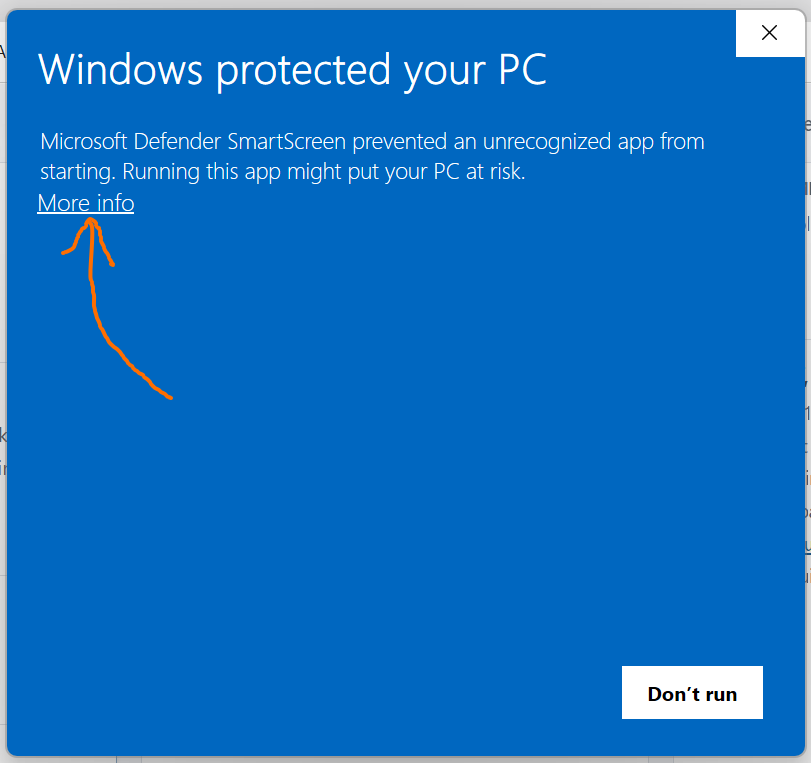
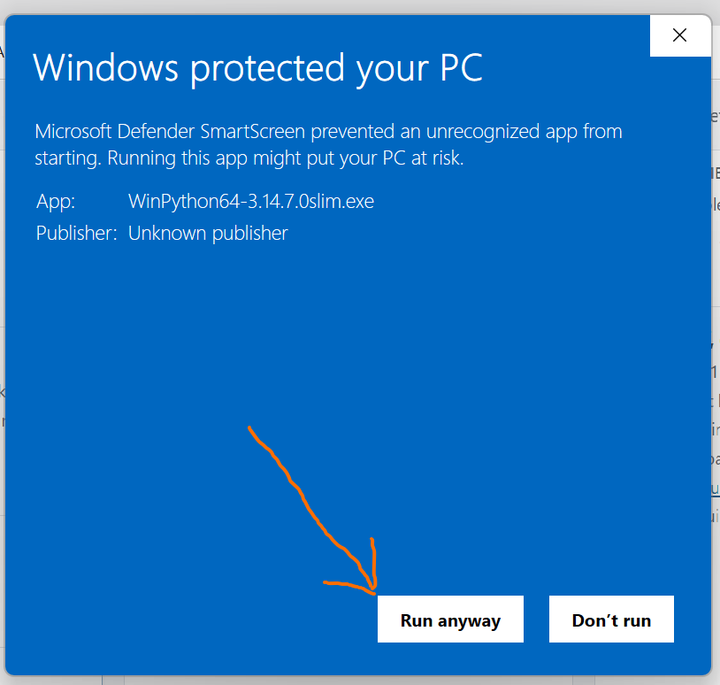
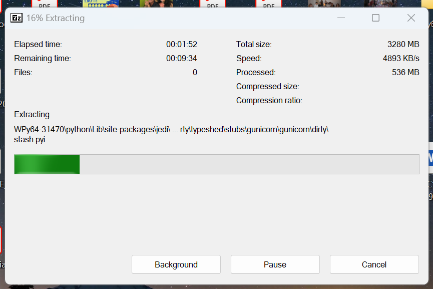

# Download and extract WinPython onto your Desktop

This guide shows how to download WinPython and unpack it into a folder on your Windows Desktop.

The screenshots use **WinPython64-3.14.7.0slim.exe**.

## 1. Download WinPython

1. Open the [official WinPython website](https://winpython.github.io/).
2. Find **WinPython 3.14.7.0**, choose the **slim** edition, and click its **.exe** download link.
3. If your browser asks where to save the file, choose **Desktop**. Otherwise, let the download finish, open your **Downloads** folder in File Explorer, and move `WinPython64-3.14.7.0slim.exe` to your **Desktop**.

**Checkpoint:** the downloaded file is on your Desktop, and the browser shows that the download is complete.

## 2. Open the downloaded file

Double-click `WinPython64-3.14.7.0slim.exe` on your Desktop. It is a **self-extracting archive**.

Windows may display **“Windows protected your PC”**, as shown below. Click **More info** to see the filename and the additional button.

Click **Run anyway** to continue.

If no warning appears, continue to the next step.

## 3. Extract the files onto your Desktop

1. If the extractor asks for a destination, use its browse button to select **Desktop**. Select the Desktop folder itself; WinPython will create its own folder inside it.
2. Start the extraction using the **Extract** button, if prompted.
3. Wait for extraction to finish. This can take several minutes. Leave the window open and do not click **Cancel**.

The screenshot below shows extraction in progress at **16%**.

## 4. Check the extracted folder

When extraction finishes, look on your Desktop for a folder named **`WPy64-31470`**. Windows may shorten the displayed name to `WPy64-31...`, as in the screenshot.

Double-click the folder to check that it opens and contains the extracted files. You now have WinPython unpacked on your Desktop. The folder contains the usable installation; the downloaded `.exe` is the compressed archive you used to create it.

## If something goes wrong

- **Cannot find the download:** check **Downloads** in File Explorer, then move the `.exe` to your Desktop.
- **Cannot find the extracted folder:** check the destination used by the extractor. If necessary, open the `.exe` again and select **Desktop** explicitly.
- **Extraction reports insufficient space:** free up disk space and try again. The progress screenshot shows about **3.3 GB** of extracted data; you also need room for the downloaded archive.
- **Extraction was cancelled:** run the downloaded `.exe` again and allow extraction to finish before using the folder.
