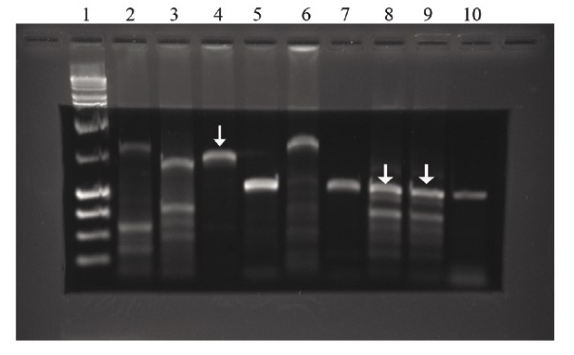

### Enzymatic protocol for PCR Product Clean-Up Prior to Sequencing

| Component                                              | Volume        |
|:-------------------------------------------------------|:--------------|
| PCR mixture                                            | 5 µL          |
| Exonuclease I (Exo I)                                  | 0.5 μL (10 U) |
| FastAP or Shrimp Alkaline Phosphatase (SAP) 1 μl (1 u) | 1 µL (1 U)    |

1. Mix well and incubate at 37°C for 15 min.
2. Stop the reaction by heating the mixture at 85°C for 15 min.

Werle, E., C. Schneider, M. Renner, M. Völker, and W. Fiehn. 1994. “Convenient Single-Step, One Tube Purification of PCR Products for Direct Sequencing.” *Nucleic Acids Research* 22 (20) (October 11): 4354–4355.

Kim, J. B., and S. Blackshaw. 2001. “One-Step Enzymatic Purification of PCR Products for Direct Sequencing.” *Current Protocols in Human Genetics / Editorial Board, Jonathan L. Haines... [et Al.]* Chapter 11 (November): Unit 11.6.

### Purification of PCR products for sequencing using 0.1% Low Melting Point Agarose (LMP)

Prepare an agarose gel.

Cut out a rectangle in the middle.

Pour 0.1% LMP agrose in the hole.

Separate the PCR product until it migrates into the LMP agarose.

Pipeting the PCR product from the LMP gel to an eppendorf tube.

Add primers and send away for sequencing.

Ma, Hao, and Stephen Difazio. 2008. “An Efficient Method for Purification of PCR Products for Sequencing.” *BioTechniques* 44 (7) (June): 921–923.

### SureClean

PCR clean up kit

Initial Step for achieving a pink-colored pellet:
Add 6μl of pink co-precipitant to your nucleic acid sample and mix
thoroughly for 30 seconds. For samples ≥ 200μl, increase the amount
of pink co-precipitant accordingly, but never use more than 20μl.
(Note: To ensure an efficient recovery, a minimum of 3μl of pink co-
precipitate must be used)

1.  Add an equal volume of SureClean to nucleic acid solution and
mix thoroughly.

2.  Incubate at room temperature for at least 10 mins.

3.  Centrifuge at maximum speed (best results at 14,000x g) in a
bench-top centrifuge for 10 minutes and carefully remove
supernatant by aspiration.
(Note: Centrifuging for longer time leads to better DNA recovery)

4.  Add a volume of 70% Ethanol equal to 2x original sample volume
and vortex for 10 seconds.
(Note: For sensitive applications an optional second ethanol wash
can be performed)

5.  Centrifuge at maximum speed (best results at 14,000 x g) in a
bench-top centrifuge for 10 minutes, remove supernatant and air-
dry to ensure complete removal of ethanol.
(Note: Do not overdry the pellet)

6.  Resuspend pellet in desired volume of TE, water or any other
appropriate buffer for downstream procedures.

Notes:

A. Apparent molecular weight of the DNA treated (agarose gel
electrophoresis) may be higher if the washing-step with 70%
ethanol step is omitted. For accurate MW assay, two washing
steps are recommended after the cleaning procedure.

B. Nucleic acids to be purified must be ≥ 100 bp.

C. Easier visualisation of the pellet can be achieved with a pink
co-precipitant which is supplied in the Bioline SureClean Plus
(BIO-37047).

- [review](http://www.biocompare.com/review/414/Biolines-SureClean-Plus.html)
- [review](https://www.biocompare.com/Product-Reviews/41180-Bioline-s-SureClean-Plus)

### Isopropanol Precipitation for PCR Purification

http://openwetware.org/wiki/Isopropanol_Precipitation_for_PCR_Purification
