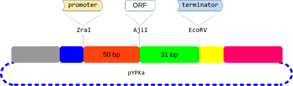

Quick links

- [[primer design\|primer_design]] for genes to be cloned in pYPKa (often necessary to express a new gene using the **Yeast Pathway Kit**)
- How [[to clone\|pYPKa-cloning-protocol]] using the pYPKa vector ([[in silico assembly of pYPKa_A_ATF1]])
- How to [[assemble\|Transcription-Unit-cloning-protocol]] a yeast expression vector (TU) ([[in silico assembly of pTA1_TDH3_ATF1_PGI1]]).
- Available [Plasmid, Promoter & Terminator](https://github.com/MetabolicEngineeringGroupCBMA/YeastPathwayKit/tree/master/sequences) sequence files.

The [MEC](https://metabolicengineeringgroupcbma.github.io) group developed a protocol for the _in-vivo_ assembly of large metabolic pathways we call the *Y*east *P*athway *K*it (YPK), see the publication in
ACS Synthetic Biology: [Pereira et. al 2015](https://pubmed.ncbi.nlm.nih.gov/26916955).

We use this protocol for the expression of large metabolic pathways that are yet relatively compact compared pathways assembled with other protocols
in _[Saccharomyces cerevisiae](https://en.wikipedia.org/wiki/Saccharomyces_cerevisiae)_. YPK relies on natural intergenic sequences which might be positive for genetic stability.

The genetic building block DNA fragments (promoters, genes and terminators) are all cloned in an _E. coli_ [positive selection](https://www.tandfonline.com/doi/abs/10.1080/07388550290789504) vector called [pYPKa](https://github.com/MetabolicEngineeringGroupCBMA/YeastPathwayKit/blob/master/sequences/pYPKa.gb).
The fragments are cloned one at a time, creating one plasmid per fragment.

These plasmids are used as template for PCR amplification and joined together by homologous recombination into single gene expression (Transcriptional Units, TU) vectors using a _S. cerevisiae/E. coli_ shuttle vector such as [pYPKpw](https://github.com/MetabolicEngineeringGroupCBMA/YeastPathwayKit/blob/master/sequences/pYPKpw.gb) or pTA1.

These TU vectors can be further assembled into large (at least 13 expressed genes has been successfully assembled) metabolic pathways by homologous recombination between promoters and terminators of the transcriptional units.
## Cloning of Genetic Building Blocks in pYPKa

The pYPKa vector is a derivative of the [positive selection vector](https://pubmed.ncbi.nlm.nih.gov/12405557)  [pCAPs](https://pubmed.ncbi.nlm.nih.gov/9514792). This vector is very efficient and permits rapid cloning of unpurified PCR products.
Promoters, genes and terminators are cloned in one of three unique restriction sites in pYPKa all producing blunt cuts (Table#1).

| Table#1 | Element    | Cloning site                                                                                                                                               |
| ------- | ---------- | ---------------------------------------------------------------------------------------------------------------------------------------------------------- |
|         | Promoters  | [ZraI](http://rebase.neb.com/rebase/enz/ZraI.html)                                                                                                         |
|         | Gene       | [AjiI](http://rebase.neb.com/rebase/enz/AjiI.html) [BtrI](http://rebase.neb.com/rebase/enz/BtrI.html) [BmgBI](http://rebase.neb.com/rebase/enz/BmgBI.html) |
|         | Terminator | [EcoRV](http://rebase.neb.com/rebase/enz/EcoRV.html) [Eco32I](http://rebase.neb.com/rebase/enz/Eco32I.html)                                                |

These sites are located close together in pYPKa in the order given above. The figure below shows the ZraI and AjiI cut sites separated by 50 bp (red in the figure below)
and AjiI and EcoRV separated by 31 bp (green).

**NB** only one fragment (a promoter, gene **or** a terminator) is cloned per plasmid.

## Naming convention

The resulting plasmids are named using an established nomenclature.

pYPKa plasmids carrying the ABC1 fragment cloned in the **ZraI** site are named pYPKa_Z_ABC1, where "ABC1" is a short reference to the cloned DNA fragment. Optionally, a short prefix can be added indicating the strain.

We use the following prefixes: Sc for *Saccharomyces cerevisiae*, Ec for *Escherichia coli* and Yl for *Yarrowia Lipolytica* and At for *Arabidopsis thaliana*. For other cases, consider using the [KEGG](https://www.genome.jp/kegg/catalog/org_list.html) three letter abbreviation, but with an initial capital letter.

The insert designation must be eligible as a file name or identifier so only use ASCII letters (**a -z A -Z 0-9**), hence the following characters are forbidden: ! " # $ % & \' ( ) * + , - . / : ; < = > ? @ [ \\ ] ^ _ ` { | } ~

Vectors with DNA fragments cloned in **ZraI**, **AjiI** and **EcoRV** are designated according to Table#2 below:

| Table#1 | Element    | Cloning site | Name             |
| ------- | ---------- | ------------ | ---------------- |
|         | Promoter   | **Z**raI     | pYPKa_**Z**_ABC1 |
|         | Gene       | **A**jiI     | pYPKa_**A**_ABC1 |
|         | Terminator | **E**coRV    | pYPKa_**E**_ABC1 |

One of the main ideas of the system is to reuse promoters and terminators in pYPKa_Z and pYPKa_E vectors. This [repository](https://github.com/MetabolicEngineeringGroupCBMA/YeastPathwayKit#readme) has over
**sixty** _S. cerevisiae_ intergenic sequences cloned in pYPKa.

Look at the [[specific protocol\|pYPKa-cloning-protocol]] for the practical protocol on how to clone using pYPKa in the lab.

An example is provided for how to use the excellent DNA editor [[ApE]] in order to manually assemble a pYPKa clone _in-silico_ or how to use Google Colab, python and pydna to automatically design PCR primers  for a series of DNA fragments to be cloned in pYPKa as well as the predicted sequences.

[[in silico assembly of a pYPKa vector]].

## Assembly of Single Gene Transcription Unit (TU) vectors

The purpose of the pYPKa_* vectors described in the previous section is to provide building blocks for _S. cerevisiae_ expression vectors, **each** expressing **one** gene.

Single genes are cloned between a promoter and a terminator by _in-vivo_ homologous recombination between three PCR products obtained from pYPKa_* vectors and a linearized _S. cerevisiae_/_E. coli_ shuttle vector.

Since promoters genes and terminators are cloned in essentially the same vector, DNA fragments sharing terminal homology are easily produced by choosing the right PCR primers.

Approximate location of six PCR primers used for this purpose are indicated by numbers in the figure below (577, 567, 468, 467, 568, 578).

Promoters are amplified using primers 577, 567, genes using 468, 467 and terminators using 568, 578.

The three PCR products are mixed with a linearized shuttle vector (pYPKpw or similar). The linear vector is the red dashed line in the figure below.
The vector carries regions of homology to the promoter and terminator PCR products, gray and pink boxes respectively.

See the [[specific protocol\|Transcription-Unit-cloning-protocol]] for how to construct a TU vector in the lab.
A combination of web services, the software package pydna and and Google colab can be used to rapidly
assemble the sequence by [[in silico assembly of pTA1_TDH3_ATF1_PGI1]].

## Naming convention

## Assembly of Multiple Gene Expression Constructs

Metabolic pathways can later be built by linking single gene expression cassettes together in a second assembly step. This assembly has to be carefully planned already before the construction of the TU vectors. Transcriptional units are joined by recombination between mutually shared  promoter and terminator sequences.

For this to be possible, promoters and terminators need to be identical DNA fragments in adjacent transcriptional units.
## Summaries and cheat sheets for the Yeast Pathway Kit

Primer locations around the ZraI, AjiI and EcoRV sites in pYPKa:

Primer locations around the ZraI, AjiI and EcoRV sites in pYPKpw and derived vectors, such as the pTAx series:

A short summary of the Yeast Pathway Kit:

PDF versions of the images above are available [here](https://github.com/MetabolicEngineeringGroupCBMA/YeastPathwayKit/blob/master/docs/A3_YPK_poster.pdf).
