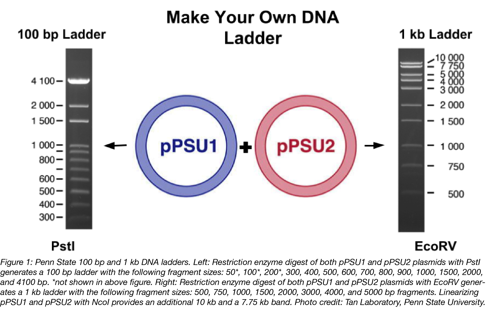
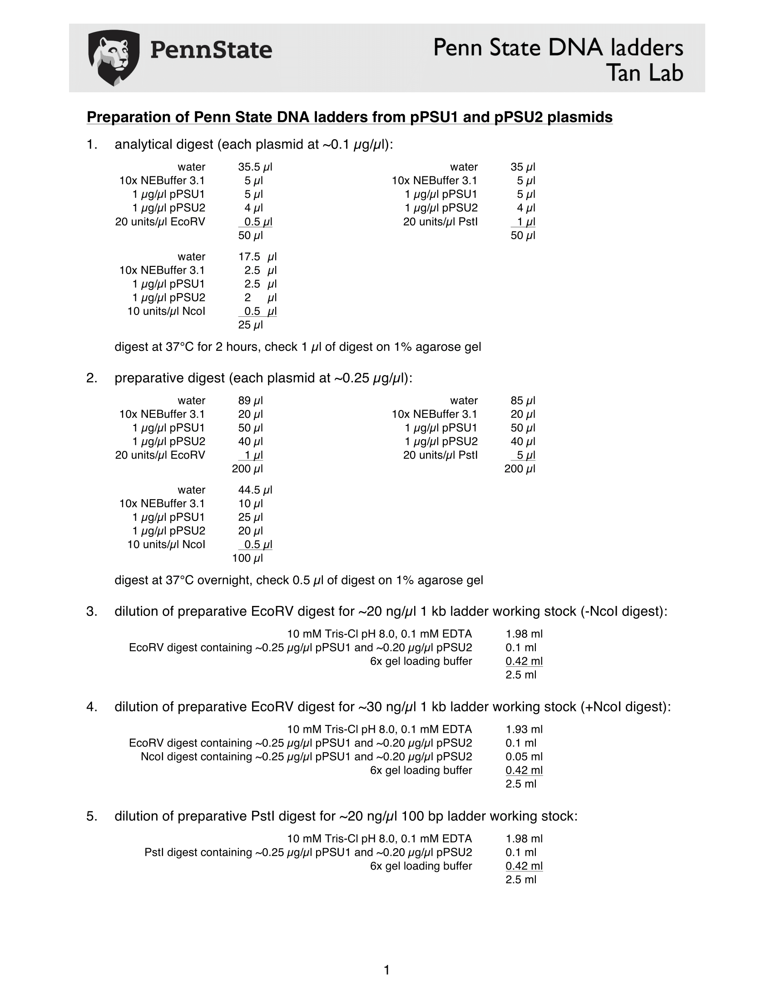

### Preparation of Penn State DNA ladders

This procedure is based on the [CAVAN low cost plasmid miniprep protocol without kit (super snik)](https://github.com/MetabolicEngineeringGroupCBMA/MetabolicEngineeringGroupCBMA.github.io/wiki/CAVAN-low-cost-plasmid-miniprep-protocol-without-kit-%28super-snik%29) and uses the same solutions
NEVER MIX pPSU1 AND pPSU2 SUSPENSIONS/SOLUTIONS UNTIL AFTER ENZYMATIC DIGESTION!

Ladder preparation:

- Inoculate each XL1-BLue colony (pPSU1 and pPSU2) in 50 mL of LB+amp O/N 37°C shaking (2 250 mL elrnemeyer flaks)
- Transfer each suspension to a 50 mL falcon and spin down at 5000 RPM for 10 min
- Resuspend each pellet with 3 mL of Resuspension solution (vortex)
- Aliquot each suspension in  600 µL volumes in 2 mL tubes (10-12 tubes for each plasmid)
- Add 600 µL Lysis solution and invert 3X (do NOT vortex)
- Incubate for ~3 min 30 s (no longer than  5 minutes!)
- Add 600 µL Neutralization solution and invert 3X (do NOT vortex)
- Incubate up to 5 minutes
- Spin down for 30 min at 14000 RPM at 4°C
- Aliquot supernatant in  1 mL volumes in 2 mL tubes (~20 tubes each plasmid)
- Add 1 mL of Isopropanol (precipitation)
- Vortex and incubate 2 min at RT
- Spin down for 1 h (14000 RPM)
- Discard supernatan
- Wash pellet with 500 µl of 70% EtOH
- Spin down at 4°C for 5 min at 14000RPM
- Discard supernatan
- Repeat washing step
- Dry pellet with speedvac for 30 min (or overnight to the air)
- Add 50 µL of ultra pure H2O
- Mix all 50 µL aliquots of the same plasmid into the same 2mL tubes with 1 mL for each tube (DON'T mix pPSU1 and pPSU2)
- Add 790 µL of ultra pure H2O to each tube
- Add 200 µL of the apropriate digestion buffer to each tube
- Add 10 µL of either EcoRV or NcoI(or BglII) to each pPSU1 tube and to each pPSU2 tube
- Vortex and incubate 36 h at 37°C
- Inactivate restriction enzymes by incubating 30 min at 80ºC
- In a 2 mL tube, mix 250 µL of EcoRV digested pPSU1, 250 µL of EcoRV digested pPSU2,250 µL of NcoI(or BglII) digested pPSU1 and 250 µL of NcoI(or BglII) digested pPSU2. Add 1 mL of loading buffer (2X or of greater concentration)

Plasmids [pPSU1](http://www.addgene.org/89439) (10kb) and [pPSU2](https://www.addgene.org/89566) (7.75kb) are
two plasmids that can be used to create DNA molecular weight markers
(DNA ladders) for size comparisons on agarose or polyacrylamide gels.

These plasmids are described here [Henrici RC, Pecen TJ, Johnston JL et al. The pPSU Plasmids for Generating DNA
Molecular Weight Markers. Sci Rep 2017;7:2438.](https://www.nature.com/articles/s41598-017-02693-1)

A mixture of both plasmids cut with PstI produces a 100 bp ladder while digestion with EcoRV yields a 1 kb ladder.

[Preparation-of-Penn-State-DNA-ladders](Preparation-of-Penn-State-DNA-ladders.pdf)

