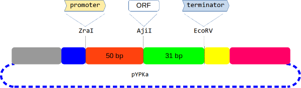
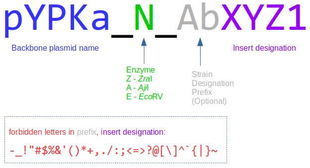
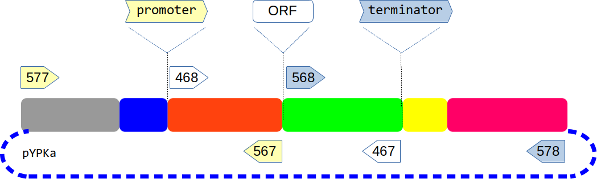
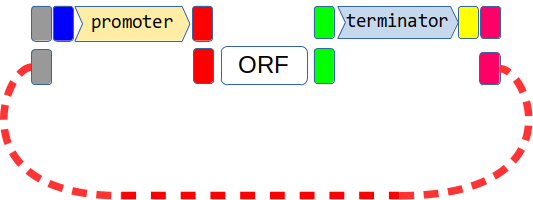
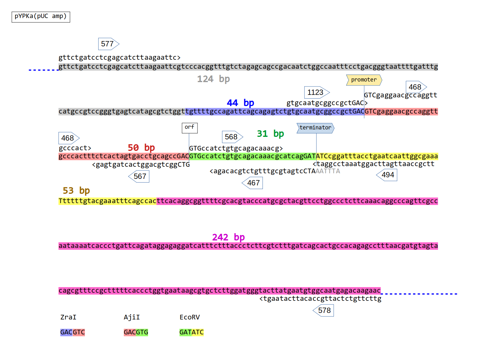
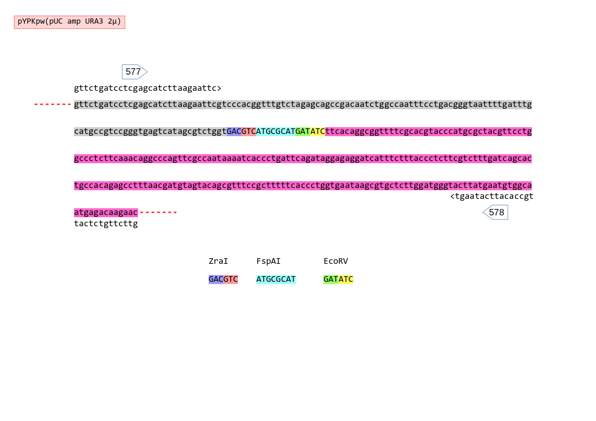
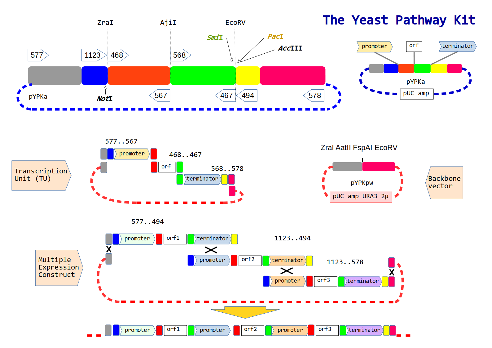

![[The Yeast Pathway Kit-20240713073233879.png|1112]]

The [MEC](https://metabolicengineeringgroupcbma.github.io) group developed a protocol for the _in-vivo_ assembly of large metabolic pathways we call the **Y**east **P**athway **K**it (YPK). This protocol was published here [Pereira et. al 2015](https://pubmed.ncbi.nlm.nih.gov/26916955).
Th protocol offers reusable promoters and terminators cloned in a vector called pYPKa. Each gene of a pathway is first cloned as a single transcriptional unit (TU). Several TUs can assemble into a multi gene pathway.

Quick links:

- [[primer design\|Primer design]] for genes to be cloned in pYPKa (often necessary to express a new gene using the **Yeast Pathway Kit**)
- [[in silico assembly of pYPKa_A_ATF1\|Example]] of *in-silico* assembly of a pYPKa vector for the expression of a gene
- [[in silico assembly of pTA1_TDH3_ATF1_PGI1\|Example]] of how to assemble a Transcritional Unit *in-silico*
- Available [Plasmid, Promoter & Terminator]([https://github.com/MetabolicEngineeringGroupCBMA/YeastPathwayKit/tree/master/sequences](https://github.com/MetabolicEngineeringGroupCBMA/public-sequences/tree/main/YeastPathwayKit/sequences)) sequence files
- How [[pYPKa cloning protocol\|to clone]] using the pYPKa vector in the wet lab
- How to [[Transcription Unit cloning protocol\|assemble]] a yeast expression vector (TU) in the wet lab

We use this protocol for the generation of expression cassettes (TU, transcriptional units) as well as large metabolic pathways that are yet relatively compact compared to pathways assembled with other protocols in _[Saccharomyces cerevisiae](https://en.wikipedia.org/wiki/Saccharomyces_cerevisiae)_. YPK relies on natural intergenic sequences which might be positive for genetic stability.

The genetic building block DNA fragments (promoters, genes and terminators) are all cloned in an _E. coli_ [positive selection](https://www.tandfonline.com/doi/abs/10.1080/07388550290789504) vector called [pYPKa](https://github.com/MetabolicEngineeringGroupCBMA/YeastPathwayKit/blob/master/sequences/pYPKa.gb).
The fragments are cloned one at a time, creating one plasmid per fragment.

These plasmids are used as template for PCR amplification and joined together by homologous recombination into single gene expression vectors (Transcriptional Units, TU)  using a _S. cerevisiae/E. coli_ shuttle vector such as the pTAx series or [pYPKpw](https://github.com/MetabolicEngineeringGroupCBMA/YeastPathwayKit/blob/master/sequences/pYPKpw.gb).

These TU vectors can be further assembled into large (at least 13 genes has been successfully assembled) metabolic pathways by homologous recombination between promoters and terminators of the transcriptional units.

## Cloning of Genetic Building Blocks in pYPKa

The pYPKa vector is a derivative of the [positive selection vector](https://pubmed.ncbi.nlm.nih.gov/12405557)  [pCAPs](https://pubmed.ncbi.nlm.nih.gov/9514792). This vector is very efficient and permits direct cloning of PCR products directly from the PCR mix.

Promoters, genes and terminators are cloned in one of three unique restriction sites in pYPKa all producing blunt cuts (Table#1).

| Table#1 | Element    | Cloning site                                                                                                                                               |
| ------- | ---------- | ---------------------------------------------------------------------------------------------------------------------------------------------------------- |
|         | Promoters  | [ZraI](http://rebase.neb.com/rebase/enz/ZraI.html)                                                                                                         |
|         | Gene       | [AjiI](http://rebase.neb.com/rebase/enz/AjiI.html) [BtrI](http://rebase.neb.com/rebase/enz/BtrI.html) [BmgBI](http://rebase.neb.com/rebase/enz/BmgBI.html) |
|         | Terminator | [EcoRV](http://rebase.neb.com/rebase/enz/EcoRV.html) [Eco32I](http://rebase.neb.com/rebase/enz/Eco32I.html)                                                |

These sites are located close together in pYPKa in the order given in Table#1. The figure below shows the ZraI and AjiI cut sites separated by 50 bp (red in the figure below)
and AjiI and EcoRV separated by 31 bp (green).



>[!Note]
>only one DNA fragment (a promoter, gene **or** a terminator) is cloned in each  pYPKa plasmid.

## Naming convention for pYPKa vectors

The resulting plasmids are named using an established nomenclature.



A pYPKa plasmids carrying the *ABC1* fragment cloned in the **ZraI** site are named *pYPKa_Z_ABC1*, where "ABC1" is a short reference to the cloned DNA fragment. Optionally, a short prefix can be added indicating the strain or organism from which the gene was sourced.

We use the following prefixes: Sc for *Saccharomyces cerevisiae*, Ec for *Escherichia coli* and Yl for *Yarrowia Lipolytica* and At for *Arabidopsis thaliana*. For other cases, consider using the [KEGG](https://www.genome.jp/kegg/catalog/org_list.html) three letter abbreviation, but with an initial capital letter.

The insert designation must allow the plasmid name to be a **file name**, so only use ASCII letters (**a -z A -Z 0-9**), hence the following characters should be avoided: ! " # $ % & \' ( ) * + , - . / : ; < = > ? @ [ \\ ] ^ _ ` { | } ~

Thus, vectors with DNA fragments cloned in **ZraI**, **AjiI** and **EcoRV** are designated according to Table#2 below:

| Table#2 | Element    | Cloning site | Name             |
| ------- | ---------- | ------------ | ---------------- |
|         | Promoter   | **Z**raI     | pYPKa_**Z**_ABC1 |
|         | Gene       | **A**jiI     | pYPKa_**A**_ABC1 |
|         | Terminator | **E**coRV    | pYPKa_**E**_ABC1 |

One of the advantages of the system is the reuse promoters and terminators in pYPKa_Z and pYPKa_E vectors. This [repository](https://github.com/MetabolicEngineeringGroupCBMA/YeastPathwayKit#readme) has over **sixty** _S. cerevisiae_ intergenic sequences cloned in pYPKa.
## Primer design

Certain conventions should be followed for [[primer design]] for genes to be cloned in the pYPKa for gene expression, i.e. creating a new pYPKa_A_xxx vector.
## In-silico assembly

It is a good practice to create a new cloning project in-silico prior to starting the lab work. This [[in silico assembly of pYPKa_A_ATF1\|example]] is provided for how to use the excellent DNA editor [[ApE]] in combination with [PydnaWeb](https://pydna.pythonanywhere.com/) to manually assemble a pYPKa clone _in-silico_.
## Wet-lab protocol

Look at the [[pYPKa cloning protocol]] for how to clone a PCR product using pYPKa in the lab.
## Assembly of Single Gene Transcription Unit (TU) vectors

The purpose of the pYPKa_* vectors described in the previous section is to provide building blocks for TUs (Transcriptional Units), **each** expressing **one** gene. A single gene is cloned between a promoter and a terminator by _in-vivo_ homologous recombination between three PCR products obtained from pYPKa_* vectors and a linearized _S. cerevisiae_/_E. coli_ shuttle vector.

Since all fragment are cloned in the same vector, DNA fragments sharing terminal homology are easily produced by choosing the right PCR primers.

Approximate location of six PCR primers used for this purpose are indicated by numbers in the figure below (577, 567), (468, 467) and (568, 578).




Promoters are amplified using primers **577+567**, genes using **468+467** and terminators using **568+578**.

The three PCR products are mixed with a linearized shuttle vector (pYPKpw or similar). The linear vector is the red dashed line in the figure below.The vector carries regions of homology to the promoter and terminator PCR products, gray and pink boxes respectively.




See the [[Transcription Unit cloning protocol\|specific protocol]] for how to construct a TU vector in the lab. A combination of web services, the software package pydna and and Google colab can be used to rapidly
assemble the sequence (see [[in silico assembly of pTA1_TDH3_ATF1_PGI1\|here]]).


## Naming convention


## Assembly of Multiple Gene Expression Constructs

Metabolic pathways can later be built by linking single gene expression cassettes together in a second assembly step. This assembly has to be carefully planned already before the construction of the TU vectors. Transcriptional units are joined by recombination between mutually shared  promoter and terminator sequences.

For this to be possible, promoters and terminators need to be identical DNA fragments in adjacent transcriptional units.
## Summaries and cheat sheets for the Yeast Pathway Ki

Primer locations around the ZraI, AjiI and EcoRV sites in pYPKa:





Primer locations around the ZraI, AjiI and EcoRV sites in pYPKpw and derived vectors, such as the pTAx series:





A short summary of the Yeast Pathway Kit:





PDF versions of the images above are available [here](https://github.com/MetabolicEngineeringGroupCBMA/YeastPathwayKit/blob/master/docs/A3_YPK_poster.pdf).

Paper version taped to the fridge in the lab:
![[Yeast pathway kit.JPG|1220]]


Some alternative primers:

```
                             >-gene-->
            >-TP-->           \     /           >-TP-->
             \   /             \   /             \   /
     517>     \ /               \ /               \ /
 p577>    1123>|p468>       <p567|p568>       <p467|<494        <p578    
               |                 |                 |
               |                 |                 |
               |                 |                 |
               |                 |                 |
           775>|                 |                 |<778
  167>    <511 |<776             |             777>|    <512     <166
               |                 |                 |               <342
               |                 |                 |
 ✽✽gray✽blue✽N-Z======red========A++++++green+++++E-A••yellow••pink••••••
|            o r                 j                 c c                   |
|            t a                 i                 o c                   |
|            I I                 I                 R I                   |
|                               (*)                V I                   |
|                                                    I                   |
```


```
>GRAYDIAGONAL (pink) 124 bp GC 50% This sequence is present in [[pYPKpw]] 577 -
gttctgatcctcgagcatcttaagaattcgtcccacggtttgtctagagcagccgacaatctggccaatttcctgacgggtaattttgatttgcatgccgtccgggtgagtcatagcgtctgg

>BLUE 44 bp GC 55%   ? - 511
tgttttgccagattcagcagagtctgtgcaatgcggccgctGAC

>RED 50 bp GC 60% 468 567
GTCgaggaacgccaggttgcccactttctcactagtgacctgcagccGAC

>GREEN 31 bp GC 52% 568 467
GTGccatctgtgcagacaaacgcatcagGAT

>YELLOW 53 bp GC 36% 500 - (166? 1219? too long)
ATCcggatttacctgaatcaattggcgaaattttttgtacgaaatttcagcca

>PINKVERTICAL 242 bp GC 48% This sequence is present in [[pYPKpw]]     ?  - 578
cttcacaggcggttttcgcacgtacccatgcgctacgttcctggccctcttcaaacaggcccagttcgccaataaaatcaccctgattcagataggagaggatcatttctttaccctcttcgtctttgatcagcactgccacagagcctttaacgatgtagtacagcgtttccgctttttcaccctggtgaataagcgtgctcttggatgggtacttatgaatgtggcaatgagacaagaac
```


# GFP fusion

```
*promoter=
         =genetxt+
                 +terminator•

*promoter=
         =gene~
              ~gfp+
                  +terminator•

*promoter=
         =mcs~
             ~gfp+
                 +CYC1t•    
```

~ = [[linkers]] (35 bp)

