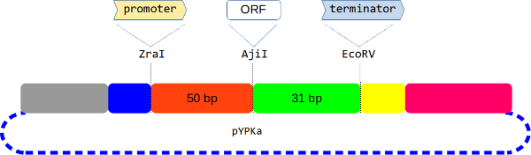
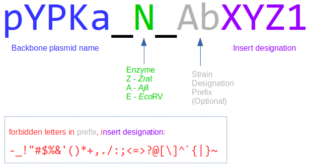
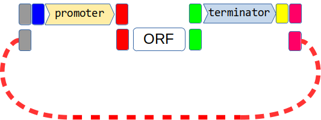

![[The Yeast Pathway Kit-20240713073233879.png|1112]]

The [MEC](https://metabolicengineeringgroupcbma.github.io) group developed the **Y**east **P**athway **K**it (YPK) protocol for the _in-vivo_ assembly of multiple genes. This protocol was published ([Pereira et. al 2015](https://pubmed.ncbi.nlm.nih.gov/26916955)).
The protocol offers reusable promoters, genes and terminators.

Quick links:

- [[primer design|Primer design]] for genes to be cloned in pYPKa (often necessary to express a new gene using the **Yeast Pathway Kit**)
- [[in silico assembly of pYPKa_A_ScATF1|Example]] of _in-silico_ assembly of a pYPKa vector for the expression of a gene
- [[in silico assembly of pTA1_TDH3_ScATF1_PGI1|Example]] of how to assemble a Transcriptional Unit (TU) vector _in-silico_
- Available [Plasmid, Promoter & Terminator](https://github.com/MetabolicEngineeringGroupCBMA/public-sequences/tree/main/YeastPathwayKit/sequences) sequence files
- How to [[pYPKa cloning protocol|clone]] a DNA fragment using the pYPKa vector in the wet lab
- How to [[Transcription Unit cloning protocol|assemble]] a single gene yeast expression vector (TU vector) in the wet lab

We use this protocol for the generation of expression cassettes (TU, transcriptional units) as well as large metabolic pathways that are yet relatively compact compared to pathways assembled with other protocols in _Saccharomyces cerevisiae_. YPK relies on natural intergenic sequences which might be positive for genetic stability.

The genetic building block DNA fragments (promoters, genes and terminators) are all cloned in an _E. coli_ [positive selection](https://www.tandfonline.com/doi/abs/10.1080/07388550290789504) vector called [pYPKa](https://github.com/MetabolicEngineeringGroupCBMA/public-sequences/blob/main/YeastPathwayKit/sequences/pYPKa.gb).
The fragments are cloned one at a time, creating one plasmid per fragment.

These plasmids are used as template for PCR amplification and joined together by homologous recombination into single gene expression vectors (Transcriptional Units, TU)  using a _S. cerevisiae/E. coli_ shuttle vector such as the pTAx series or pYPKpw (sequences [here](https://github.com/MetabolicEngineeringGroupCBMA/public-sequences/tree/main/YeastPathwayKit)).

These TU vectors can be further assembled into large (at least 13 genes has been successfully assembled) metabolic pathways by homologous recombination between promoters and terminators of the transcriptional units.

## Cloning of Genetic Building Blocks in pYPKa

The pYPKa vector is a derivative of the [positive selection vector](https://pubmed.ncbi.nlm.nih.gov/12405557)  [pCAPs](https://pubmed.ncbi.nlm.nih.gov/9514792). This vector is very efficient and permits direct cloning of PCR products directly from the PCR mix without removal of the DNA polymerase, primers or nucleotides.

Promoters, genes and terminators are cloned in one of three unique blunt restriction sites in pYPKa (Table#1).

| Table#1 | Element    | Cloning site                                         | Name             | Alternative enzymes                                                                                     |
| ------- | ---------- | ---------------------------------------------------- | ---------------- | ------------------------------------------------------------------------------------------------------- |
|         | Promoters  | [ZraI](http://rebase.neb.com/rebase/enz/ZraI.html)   | pYPKa\_**Z**_ABC1 | -                                                                                                       |
|         | Gene (orf) | [AjiI](http://rebase.neb.com/rebase/enz/AjiI.html)   | pYPKa_**A**_ABC1 | [BtrI](http://rebase.neb.com/rebase/enz/BtrI.html) [BmgBI](http://rebase.neb.com/rebase/enz/BmgBI.html) |
|         | Terminator | [EcoRV](http://rebase.neb.com/rebase/enz/EcoRV.html) | pYPKa_**E**\_ABC1 | [Eco32I](http://rebase.neb.com/rebase/enz/Eco32I.html)                                                  |

These sites are located close together in pYPKa in the order given in Table#1. The figure below shows the ZraI and AjiI cut sites separated by 50 bp (red in the figure below) and AjiI and EcoRV separated by 31 bp (green).



> [!Note]
> Only one DNA fragment (a promoter, gene **or** a terminator) is cloned in each  pYPKa plasmid.

## Naming convention for pYPKa vectors

The resulting plasmids are named using a systematic nomenclature. A pYPKa plasmid carrying the _ABC1_ fragment cloned in the **ZraI** site is named **pYPKa\_Z\_ABC1**. Optionally, a short prefix can be added indicating the strain or organism from which the gene was sourced.



We use the following prefixes: Sc for _Saccharomyces cerevisiae_, Ec for _Escherichia coli_ and Yl for _Yarrowia Lipolytica_ and At for _Arabidopsis thaliana_. For other cases, consider using the [KEGG](https://www.genome.jp/kegg/catalog/org_list.html) three letter abbreviation.

> [!Note]
> The plasmid name should also function as a **file name**, so only use ASCII letters (**a -z A -Z 0-9**). Avoid these characters: ! " # \$ % & ' ( ) \* + , - . / : ; < = > ? @ \[ \ ] ^ \_ \` { | } ~

Promoters and terminators in pYPKa\_Z and pYPKa\_E vectors can be reused. This [repository](https://github.com/MetabolicEngineeringGroupCBMA/public-sequences/tree/main/YeastPathwayKit) has over **sixty** _S. cerevisiae_ intergenic sequences cloned in pYPKa.

## Primer design

Certain conventions should be followed for [[primer design]] for genes to be cloned in the pYPKa for gene expression, i.e. creating a new pYPKa\_**A**\_ABC1 vector.

## In-silico assembly

It is a good practice to create a new cloning project in-silico prior to starting the lab work. This [[in silico assembly of pYPKa_A_ScATF1|example]] is provided for how to use the DNA editor [[ApE]] in combination with [PydnaWeb](https://pydna.pythonanywhere.com/) to manually assemble a pYPKa clone _in-silico_.

## Wet-lab protocol

Look at the [[pYPKa cloning protocol]] for how to clone a PCR product using pYPKa in the lab.

## Assembly of Single Gene Transcription Unit (TU) vectors

The purpose of the pYPKa\_\* vectors described in the previous section is to provide building blocks for TUs (Transcriptional Units), **each** expressing **one** gene. A single gene is cloned between a promoter and a terminator by _in-vivo_ homologous recombination between three PCR products obtained from pYPKa\_\* vectors and a linearized _S. cerevisiae_/_E. coli_ shuttle vector.

Since all fragment are cloned in the same vector, DNA fragments sharing terminal homology are easily produced by choosing the right PCR primers.

Approximate location of six PCR primers used for this purpose are indicated by numbers in the figure below (577, 567), (468, 467) and (568, 578).


Promoters are amplified using primers **577+567**, genes using **468+467** and terminators using **568+578**.

The three PCR products are mixed with a linearized shuttle vector (pYPKpw or similar). The linear vector is the red dashed line in the figure below.The vector carries regions of homology to the promoter and terminator PCR products, gray and pink boxes respectively.



See the [[Transcription Unit cloning protocol|specific protocol]] for how to construct a TU vector in the lab. A combination of web services, the software package pydna and and Google colab can be used to rapidly assemble the sequence (see [[in silico assembly of pTA1_TDH3_ScATF1_PGI1|here]]).

## Naming convention


## Assembly of Multiple Gene Expression Constructs

Metabolic pathways can later be built by linking single gene expression cassettes together in a second assembly step. This assembly has to be carefully planned already before the construction of the TU vectors. Transcriptional units are joined by recombination between mutually shared  promoter and terminator sequences.

For this to be possible, promoters and terminators need to be identical DNA fragments in adjacent transcriptional units.

## Summaries and cheat sheets for the Yeast Pathway Kit

Primer locations around the ZraI, AjiI and EcoRV sites in pYPKa:


Primer locations around the ZraI, AjiI and EcoRV sites in pYPKpw and derived vectors, such as the pTAx series:


A short summary of the Yeast Pathway Kit:


PDF versions of the images above are available [here](https://github.com/MetabolicEngineeringGroupCBMA/YeastPathwayKit/blob/master/docs/A3_YPK_poster.pdf).

Paper version taped to the fridge in the lab:
![[files/Yeast pathway kit.JPG|1220]]

Some alternative primers:

```
                             >-gene-->
            >-TP-->           \     /           >-TP-->
             \   /             \   /             \   /
     517>     \ /               \ /               \ /
 p577>    1123>|p468>       <p567|p568>       <p467|<494        <p578       < recommended
               |                 |                 |
               |                 |                 |
               |                 |                 |
               |                 |                 |
           775>|                 |                 |<778
  167>    <511 |<776             |             777>|    <512     <166
               |                 |                 |               <342
               |                 |                 |
 ✽✽graydi✽blue✽N-Z======red========A++++++green+++++E-A••yellow••pink••••••
|            o r                 j                 c c                   |
|            t a                 i                 o c                   |
|            I I                 I                 R I                   |
|                               (*)                V I                   |
|                                                    I                   |
```

[[GRAYDIAGONAL]]-[[BLUE]]-[[RED]]-[[GREEN]]-[[YELLOW]]-[[GRAYVERTICAL]]

```
>GRAYDIAGONAL 124 bp GC 50% This sequence is present in [[pYPKpw]] 577 -
gttctgatcctcgagcatcttaagaattcgtcccacggtttgtctagagcagccgacaatctggccaatttcctgacgggtaattttgatttgcatgccgtccgggtgagtcatagcgtctgg

>BLUE 44 bp GC 55%   ? - 511
tgttttgccagattcagcagagtctgtgcaatgcggccgctGAC

>RED 50 bp GC 60% 468 567
GTCgaggaacgccaggttgcccactttctcactagtgacctgcagccGAC

>GREEN 31 bp GC 52% 568 467
GTGccatctgtgcagacaaacgcatcagGAT

>YELLOW 53 bp GC 36% 500 - (166? 1219? too long)
ATCcggatttacctgaatcaattggcgaaattttttgtacgaaatttcagcca

>GRAYVERTICAL 242 bp GC 48% This sequence is present in pYPKpw     ?  - 578
cttcacaggcggttttcgcacgtacccatgcgctacgttcctggccctcttcaaacaggcccagttcgccaataaaatcaccctgattcagataggagaggatcatttctttaccctcttcgtctttgatcagcactgccacagagcctttaacgatgtagtacagcgtttccgctttttcaccctggtgaataagcgtgctcttggatgggtacttatgaatgtggcaatgagacaagaac
```

# GFP fusion

```
*promoter=
         =genetxt+
                 +terminator•

*promoter=
         =gene~
              ~gfp+
                  +terminator•

*promoter=
         =mcs~
             ~gfp+
                 +CYC1t•
```

\~ = [[linkers]] (35 bp)
