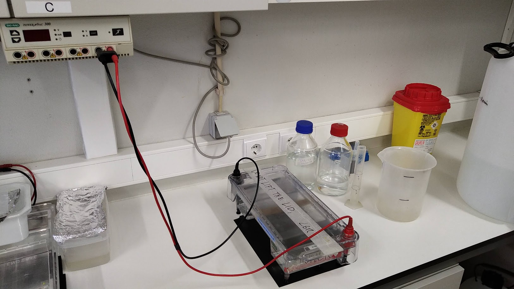

- 1.6 L TAE buffer 1x
- 200 volts
- about 20 min
- Bio-Rad PowerPac 300 [manual](20162-6921.pdf)

If the buffer seem dirty, please replace it with fresh buffer.

Add 50 mL 50 x [TAE](https://en.wikipedia.org/wiki/TAE_buffer) to 2 L of distilled water.

You can use the 100 mL measuring cylinder and the 2L plastic beaker to the right in the picture
to measure the buffer.

A Schott bottle with 50x TAE should be on the shelf.
