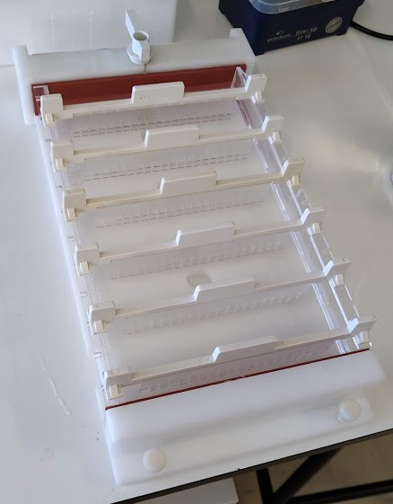

The Bio-Rad gel tray below measures 15 cm by 25 cm. I takes about 250 mL agarose (15 x 25 x 0.67 cm = 250 mL). This means 2.4 g of agarose for a 0.8 % (w/v) gel. Each gel comb has 20 teeth, so this gel has 6 \* 20 = 120 wells. The maximum DNA migration distance is 42 mm. This gel can take relatively large volume in each well.

The Bio-Rad gel tray below measures ? cm by ? cm. I takes about 300 mL agarose (15 x 25 x 0.67 cm = 300 mL). This means 3.0 g of agarose for a 1.0 % (w/v) gel. Each gel comb has 51 teeth, so this gel has 4 \* 51 = 204 wells. The maximum DNA migration distance is 44 mm, a bit more for the last row of wells. Each well is relatively small compared to the on above.

![[agarose gel casting.png|638]]
