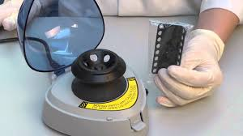

# Low-cost _E. coli_ plasmid alkaline lysis mini-prep

Also known as _snik-protokollet_ from [TMB](https://www.ple.lth.se/en/applied-microbial-physiology). A short version of this protocol can be found [[snik-short|here]].

## How The Alkaline Lysis Method Works

Three buffers, P1, P2, and P3, are used.

- **P1** is the resuspension buffer (pH 8.0), containing Tris-HCl, EDTA, and optionally RNase A.
- **P2** is the alkaline lysis buffer, containing SDS and NaOH.
- **P3** is the neutralization buffer, containing potassium acetate (pH 5.5).

Alkaline lysis separates plasmid DNA from bacterial chromosomal DNA and other cell components. In P1, EDTA binds divalent ions, inhibiting DNases, while RNase A breaks down RNA after lysis. P2 contains SDS, which disrupts cell membranes and denatures proteins, and NaOH, which denatures DNA (makes the strands separate). Gentle mixing avoids fragmenting chromosomal DNA, as small fragments can contaminate the plasmid preparation.

P3 neutralizes the mixture, allowing the small circular plasmids to renature and remain in solution. Chromosomal DNA, denatured proteins, and SDS form a precipitate that is removed by centrifugation. The plasmid DNA in the supernatant is then concentrated by alcohol precipitation, washed with 70% ethanol, dried, and dissolved in buffer.

This protocol can be used to prepare plasmid DNA from cells in liquid culture or growing on solid medium. Cells from fresh overnight cultures tend to give the best results. If cultures cannot be processed right away, pelleted cells can be stored at -20°C for future plasmid preparation. For cultures grown on solid medium, we have found that it might be better to scrape cells off the plate, wash them with P1, and store the pellet at -20°C rather than keep the plate in the fridge for several days, as cells on plates tend to become slimy after a while.

Any microcentrifuge can be used for this protocol; the maximum force generated does not seem to be critical. However, Picofuge-type centrifuges (see below) may **not** give sufficient force to pellet precipitated DNA, but are fine for spinning down cells.

## Collect cells from liquid culture

1. Grow 1-5 mL of _E. coli_ in a 1.5-2 mL Eppendorf tube at 30-37°C overnight. Larger 2 mL tubes might be better, since mixing seems more efficient. 50 mL glass culture tubes also work well. Tubes can be incubated sideways at 200 rpm.
2. Centrifuge at top speed for 30 s to recover cells.
3. Resuspend cells in 200 µL of buffer P1. Cells can be vortexed briefly or resuspended by pipetting up and down with a P1000 pipette.

## Collect cells from solid culture

1. Streak about a quarter to a half of an LB plate containing the necessary antibiotic, using a colony or a freezer stock, and incubate overnight.
2. On the next day, collect cells from at least 1/4 of the inoculated solid medium using a toothpick with a flat end.
3. Resuspend the cells in 200 µL of buffer P1. If the cells are hard to resuspend, try to transfer as much of the cell suspension as possible to another tube and leave behind the sticky biomass.

## Alkaline lysis

1. Add 200 µL of buffer P2 and mix by inversion about ten times. **Do not vortex**, as the chromosomal DNA might fragment and contaminate the plasmid DNA. **Wear goggles for this step!** Sometimes the SDS in the P2 buffer precipitates (see [[#P2|image]]). This can usually be resolved by heating water in an electric kettle and immersing the tube for 1-2 min. ⚠️ Be careful to release pressure slowly when opening the tube.

2. Incubate at room temperature for 3-5 min. **Do not incubate for more than 5 min**; monitor the time with your cell phone or a clock. If possible, slowly invert the tube during the entire incubation.

## Neutralization

1. Add 250 µL of buffer P3 and mix by inversion about ten times. **Do not vortex**, for the same reason as before.
2. Centrifuge at top speed for 5-10 min. While the centrifuge is running, add 1 mL of 96% - 99,5% ethanol
   to a new, clean 1.5 mL Eppendorf tube for each plasmid prep. 750 µL of isopropanol can be used instead of ethanol.

## Ethanol precipitation

1. Add 500 µL of the supernatant from the centrifugation to the ethanol and mix by inversion. If isopropanol is used, add as much as possible without touching the precipitate.
2. Centrifuge at top speed for 10 min.
3. Pour away the supernatant by opening and inverting the tube. The plasmid should be visible as a small white spot at the bottom of the tube.
4. Add 1 mL of 70% ethanol. Some protocols specify cold ethanol (-20°C) but ethanol at room temperature works fine.
5. Centrifuge for 1 min at top speed.

## Dry plasmid DNA

1. Pour away the supernatant by opening and inverting the tube. Be sure to remove as much of the liquid as possible. If necessary, spin the tubes a second time and remove the remaining liquid with a micropipette.

2. Let the tubes dry on the bench for 10-15 min with the lids open or at 50°C for 5 min. A [[speedvac]] can also be used if available.

![[alkaline lysis plasmid mini prep_003.png]]

## Reconstitution of plasmid DNA

1. Dissolve the pellet in 30-50 µL of a buffer such as:

| Buffer                                        | Tris-HCl (mM) | EDTA (mM) | pH          |
| --------------------------------------------- | ------------ | -------- | ----------- |
| [[TE]] buffer                                 | 10           | 0.1      | 8           |
| Qiagen EB buffer                              | 10           | -        | 8.5         |
| Qiagen Buffer AE                              | 10           | 0.5      | 9.0         |
| Sigma Genelute Elution Solution               | 10           | 1 mM     | approx. 8.0 |
| NZYMiniprep AE buffer (does not contain EDTA) | ?            | ?        | ?           |

Any resuspension buffer from a commercial plasmid miniprep kit is probably fine for this.

Done! 🎉
Store your DNA in the fridge (4-8°C) or freezer (-20°C).

## Usage

5 µL of this prep should give a fairly strong band on an agarose gel. 10 µL can be used for restriction digestion to identify correct clones. This DNA can also be used as a template for PCR or to transform _E. coli_, yeast and probably most other organisms. This DNA prep can be purified using a clean-up kit (for example, Qiagen QIAquick PCR purification columns) prior to cloning.
The DNA is pure enough to digest and use for in vivo gap repair cloning in _S. cerevisiae_.

## Notes

This procedure is based on the alkaline lysis procedure described in [Birnboim, H.C., Doly, J., 1979. A rapid alkaline extraction procedure for screening recombinant plasmid DNA. Nucleic Acids Res. 7, 1513–1523.](https://www.ncbi.nlm.nih.gov/pubmed/388356).

The procedure takes advantage of the fact that plasmids are relatively small supercoiled DNA
molecules and bacterial chromosomal DNA is much larger and less supercoiled. This difference in topology allows for selective precipitation of the chromosomal DNA and cellular proteins from plasmids and RNA molecules. The cells are lysed under alkaline conditions, which denatures both nucleic acids and proteins, and when the solution is neutralized by the addition of potassium acetate, chromosomal DNA and proteins precipitate because it is impossible for them to renature correctly (they are so large). Plasmids renature correctly and stay in solution, effectively separating them from chromosomal DNA and proteins.

## Solutions

### P1

- 50 mM Tris-HCl
- 10 mM EDTA (292,248 g/mol)
- 100 µg/mL RNase A, pH 8.0

Dissolve 6.06 g Tris base (121.14 g/mol) and 3.72 g Na2EDTA•2H2O (372.2 g/mol) in 800 mL of water.
Adjust to pH 8.0 with concentrated HCl (use protective equipment!).

Add 100 µL of RNase (20 mg/mL) to 20 mL of P1.
This solution can be stored at 4°C for long periods.
RNase is not strictly necessary, but it removes RNA from the plasmid prep.
When the cells are lysed in the next step, the RNase will catalyze hydrolysis of all RNA molecules into nucleotides, but the DNA will not be damaged.

### P2

- 1% SDS
- 0.2 M NaOH (39,99711 g/mol)

Dissolve 8 g NaOH in 950 mL of water.
Add 50 mL of a 20% (w/v) [[SDS]] water solution.

SDS is an ionic detergent that disrupts cell membranes and destabilizes all hydrophobic interactions holding various macromolecules
in their native conformation. The high pH of the 0.2 M NaOH also denatures macromolecules by changing the condition of ionizable groups
(ionizing certain groups and deionizing others).

The clearing you should see is because the cells are lysing.
The viscosity of the solution is increased by the increase in concentration of macromolecules in solution (a result of the cell lysis).

Sometimes the SDS in the P2 buffer precipitates (see below). This can be resolved by heating water in an electric kettle, immersing the tube for 1-2 min, and slowly inverting the tube a couple of times. ⚠️ Be careful to release pressure slowly when opening the tube.

![[alkaline lysis plasmid mini prep.png|802]]

### P3

- 3.0 M potassium acetate (KCH3COO; 98,14 g/mol), pH 5.5

There are two ways to prepare this solution.

Glacial or anhydrous acetic acid is essentially water-free acetic acid.
It has a density of 1.05 g/mL.
For one liter, add 3 \* 60.05 = 180.15 g of glacial acetic acid to a 1 L beaker.
Add water to about 500 mL.
Add KOH pellets until the pH is 5.5.
Be careful not to overshoot the target pH; it may be safer to use a 3 M KOH solution as you approach it.

Alternatively, dissolve 294.5 g potassium acetate powder in 500 mL of water.
Adjust the pH with glacial acetic acid (~110 mL was needed when this was attempted).
Add water to one liter.

This is probably the key step in the alkaline lysis procedure. The low pH of the potassium acetate solution
neutralizes the NaOH, and the macromolecules renature when the pH returns to near-neutrality.
The proteins and large DNA molecules do not renature correctly, however. They form hydrophobic, ionic and hydrogen
bonds with each other non-specifically because the correct conformation of the molecule was not maintained during denaturation.
The plasmid DNA molecules, however, never really fully denatured because they are small circular molecules, which are supercoiled.
Even though the hydrogen bonds between base pairs were broken by the high pH, they reform correctly when the pH is lowered.
The large DNA molecules (chromosomal DNA) and proteins form precipitates because they bind to each other in a large
aggregate, but the plasmids don't precipitate because they renature correctly and don't become part of the large multi-molecule aggregates.
Thus, plasmid DNA remains in solution while proteins and other DNA molecules precipitate.

### TE-buffer

[[TE]]

### Further reading

- Birnboim H.C. and Doly J. [A rapid alkaline extraction procedure for screening recombinant plasmid DNA.](https://academic.oup.com/nar/article-abstract/7/6/1513/2380972) _Nucleic Acids Research,_ 1979;**7**(6):1513–23.

- [How to Identify Supercoils, Nicks and Circles in Plasmid Preps](https://bitesizebio.com/13524/how-to-identify-supercoils-nicks-and-circles-in-plasmid-preps)

- [Plasmid vs. Genomic DNA Extraction: The Difference](https://bitesizebio.com/1660/plasmid-v-genomic-dna-extractionthe-difference)

- [Alkaline lysis - Wikipedia](https://en.wikipedia.org/wiki/Alkaline_lysis)

- [The Basics: How Alkaline Lysis Works](https://bitesizebio.com/180/the-basics-how-alkaline-lysis-works)

- 

- 

### Lista de materiais em Português

2-3 dias antes da aula:

- LB com ampicilina (100 µg/mL) ~ 25-50 mL
- 10 tubos 2 mL

No dia da aula:

- Pontas amarelas (novas!)
- Pontas azuis (novas!)
- 12 tubos Eppendorf com 1 mL de tampão P1 (marcados "P1")
- 12 tubos Eppendorf com 1 mL de tampão P2 (marcados "P2")
- 12 tubos Eppendorf com 1 mL de tampão P3 (marcados "P3")
- 12 tubos com 1 mL de TE x1
- 4 tubos Falcon 50 mL (usados)
- 4 suportes para tubos Eppendorf
- 4 suportes para tubos Falcon 50 mL
- 4 tubos Falcon 50 mL com 25-50 mL EtOH 96-100% (etanol absoluto para DNA/RNA)
- 4 tubos Falcon 50 mL com 25-50 mL EtOH 70% (v/v) (feito com água ultrapura)
- 4 copos com tubos Eppendorf 1.5 mL (novos, mas não necessariamente estéreis)
- microcentrífuga
- Agarose para géis
- Tampão TAE x1
- Tampão TAE stock
- 4 copos de 50-100 mL
- 1 proveta 50-100 mL
- 4 erlenmeyers 250 mL
- 2 tinas de eletroforese
- Fonte de alimentação
- Barquinhos de pesagem (plástico)

### Notes

CAVAN plasmid miniprep: This procedure is based on the alkaline lysis procedure developed by Birnboim and Doly (Nucleic Acids Research 7:1513, 1979).

Procedure:

- Inoculate 1 colony into 3 mL LB+amp; O/N 37°C shaking
- Put the cell suspension in a 2 mL tube
- Spin down at 14000 RPM for 30 s
- Resuspend with 300 µL Resuspension solution (vortex)
- Add 300 µL Lysis solution and invert 3X (do NOT vortex)
- Incubate up to 5 minutes (not longer!)
- Add 300 µL Neutralization solution and invert 3X (do NOT vortex)
- Incubate up to 5 minutes
- Spin down for 10 min at 14000 RPM at 4°C
- Pipette the supernatant into a new Eppendorf tube
- Add 750 µL of isopropanol (precipitation)
- Vortex and incubate 2 min at RT
- Spin down at 4°C for 15 min (14000 RPM)
- Discard the supernatant
- Wash pellet with 300 µL of 70% EtOH
- Spin down at 4°C for 5 min at 14000 RPM
- Discard the supernatant
- Repeat washing step
- Dry the pellet with a speedvac for 30 min (or overnight in air)
- Add 50 µL of TE-buffer
  (no guanidine hydrochloride to permanently inactivate nucleases in nuclease-rich species)

Solutions:
Resuspension solution: 50 mM Tris-HCl (121,14 g/mol), 10 mM EDTA (292,248 g/mol), 100 µg/mL RNase A, pH 8.0
Stock solution:
1 L: 6,057 g Tris + 3,722 g EDTA.2H2O ; adjust to pH 8,0 (HCl)
500 mL: 3,0285 g Tris + 1,861 g EDTA.2H2O ; adjust to pH 8,0 (HCl)

Working solution:
Add 0,6 mL of RNase (20 mg/mL) to 100 mL of resuspension solution and store at 4°C

When the cells are lysed in the next step, the RNase will catalyze hydrolysis of all RNA molecules into nucleotides, but the DNA will not be affected.

Lysis solution: 1% SDS; 0,2 M NaOH (39,99711 g/mol)
1 L: 8,0 g NaOH pellets in 900 mL MQ-water; autoclave; add 100 mL of SDS 10%
500 mL: 4,0 g NaOH pellets in 450 mL MQ-water; autoclave; add 50 mL of SDS 10%

SDS is an ionic detergent that disrupts cell membranes and destabilizes all hydrophobic interactions holding
various macromolecules in their native conformation. The high pH of the 0.2 M NaOH also denatures macromolecules by
changing the condition of ionizable groups (ionizing certain groups and deionizing others).
The clearing you see is because the cells are lysing. The viscosity of the solution is increased by the increase
in concentration of macromolecules in solution (a result of the cell lysis).

Neutralisation solution: 3.0 M potassium acetate (KCH3COO; 98,14 g/mol), pH 5.5
1 L: 294,45 g KAc in 500 mL H2O; pH to 5,5 with acetic acid (CH3COOH); H2O to 1 L
500 mL: 147,225 g KAc in 250 mL H2O; pH to 5,5 with acetic acid, H2O to 500 mL

This is really the key step in the alkaline lysis procedure. The low pH of the potassium acetate solution neutralizes
the NaOH, and the macromolecules renature when the pH returns to near-neutrality. The proteins and large DNA molecules
do not renature correctly, however. They form hydrophobic, ionic and hydrogen bonds with each other nonspecifically because
the correct conformation of the molecule was not maintained during denaturation. The plasmid DNA molecules, however, never really
fully denatured because they are small circular molecules, which are supercoiled. Even though the hydrogen bonds between base pairs
were broken by the high pH, they reform correctly when the pH is lowered. The large DNA molecules (chromosomal DNA) and proteins form
precipitates because they bind to each other in a large aggregate, but the plasmids don't precipitate because they renature correctly
and don't become part of the large multi-molecule aggregates. Thus, plasmid DNA remains in solution while proteins and other DNA molecules precipitate.

TE-buffer (1X): 1 mM EDTA (292,248 g/mol), 10 mM Tris (121,14 g/mol); HCl pH 8.0
1 L (10X): 3,722 g EDTA .2H2O  ;  12,114 g Tris
100 mL (10X): 0,3722 g EDTA .2H2O  ;  1,2114 g Tris

TE buffer is commonly used to redissolve DNA because it contains EDTA. The EDTA will chelate magnesium ions, which are a
cofactor for most nucleases (enzymes that degrade nucleic acids). If your DNA prep becomes contaminated with a nuclease
(like the ones produced by the cells in your skin) the nuclease will be inactivated by the fact that the magnesium cofactor
is unavailable in the solution (because it is chelated by the EDTA).
