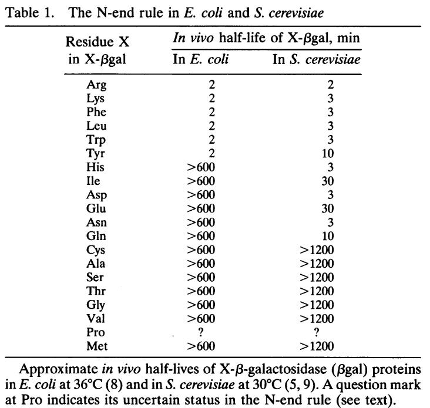
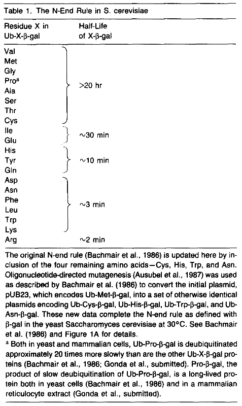

This is a wide table. Use the scroll bars to see the rightmost columns.

| Name           | Name            | NAME          | Three | THREE | One | KEGG                                       | Pubchem                                                  | Mw     | Mw-H2O | Solubility (g/100 mL H2O at 25°C) | UV Abs Log e (lmax)pH ~ 7.0 | Codons (S. cerevisiae) |     |     |     |     |     | S.cerevisiae | E.coli |
| -------------- | --------------- | ------------- | ----- | ----- | --- | ------------------------------------------ | -------------------------------------------------------- | ------ | ------ | --------------------------------- | --------------------------- | ---------------------- | --- | --- | --- | --- | --- | ------------ | ------ |
| **Alanine**    | L-Alanine       | ALANINE       | Ala   | ALA   | A   | [C00041](https://www.kegg.jp/entry/C00041) | [5950](https://pubchem.ncbi.nlm.nih.gov/compound/5950)   | 89.09  | 71.08  | 16.65                             |                             | GCT                    | GCA | GCC | GCG |     |     | **>30 h**    | >10 h  |
| Arginine       | L-Arginine      | ARGININE      | Arg   | ARG   | R   | [C00062](https://www.kegg.jp/entry/C00062) | [6322](https://pubchem.ncbi.nlm.nih.gov/compound/6322)   | 174.2  | 156.19 | 15                                |                             | AGA                    | AGG | CGT | CGA | CGC | CGG | 2 min        | 2 min  |
| Asparagine     | L-Asparagine    | ASPARAGINE    | Asn   | ASN   | N   | [C00152](https://www.kegg.jp/entry/C00152) | [6267](https://pubchem.ncbi.nlm.nih.gov/compound/6267)   | 132.12 | 114.1  | 3.53                              |                             | AAT                    | AAC |     |     |     |     | 3 min        | >10 h  |
| Aspartate      | L-Aspartate     | ASPARTATE     | Asp   | ASP   | D   | [C00049](https://www.kegg.jp/entry/C00049) | [5960](https://pubchem.ncbi.nlm.nih.gov/compound/5960)   | 133.1  | 115.09 | 0.778                             |                             | GAT                    | GAC |     |     |     |     | 3 min        | >10 h  |
| **Cysteine**   | L-Cysteine      | CYSTEINE      | Cys   | CYS   | C   | [C00097](https://www.kegg.jp/entry/C00097) | [5862](https://pubchem.ncbi.nlm.nih.gov/compound/5862)   | 121.15 | 103.15 | very soluble                      | 2.46(250 nm)                | TGT                    | TGC |     |     |     |     | **>30 h**    | >10 h  |
| Glutamate      | L-Glutamate     | GLUTAMATE     | Glu   | GLU   | E   | [C00025](https://www.kegg.jp/entry/C00025) | [33032](https://pubchem.ncbi.nlm.nih.gov/compound/33032) | 147.13 | 129.12 | 0.864                             |                             | GAA                    | GAG |     |     |     |     | 30 min       | >10 h  |
| Glutamine      | L-Glutamine     | GLUTAMINE     | Gln   | GLN   | Q   | [C00064](https://www.kegg.jp/entry/C00064) | [5961](https://pubchem.ncbi.nlm.nih.gov/compound/5961)   | 146.15 | 128.13 | 2.5                               |                             | CAA                    | CAG |     |     |     |     | 10 min       | >10 h  |
| **Glycine**    | Glycine         | GLYCINE       | Gly   | GLY   | G   | [C00037](https://www.kegg.jp/entry/C00037) | [750](https://pubchem.ncbi.nlm.nih.gov/compound/750)     | 75.07  | 57.05  | 24.99                             |                             | GGT                    | GGA | GGC | GGG |     |     | **>30 h**    | >10 h  |
| Histidine      | L-Histidine     | HISTIDINE     | His   | HIS   | H   | [C00135](https://www.kegg.jp/entry/C00135) | [6274](https://pubchem.ncbi.nlm.nih.gov/compound/6274)   | 155.16 | 137.14 | 4.19                              | 3.77(211 nm)                | CAT                    | CAC |     |     |     |     | 3 min        | >10 h  |
| Isoleucine     | L-Isoleucine    | ISOLEUCINE    | Ile   | ILE   | I   | [C00407](https://www.kegg.jp/entry/C00407) | [6306](https://pubchem.ncbi.nlm.nih.gov/compound/6306)   | 131.17 | 113.16 | 4.117                             |                             | ATT                    | ATA | ATC |     |     |     | 30 min       | >10 h  |
| Leucine        | L-Leucine       | LEUCINE       | Leu   | LEU   | L   | [C00123](https://www.kegg.jp/entry/C00123) | [6106](https://pubchem.ncbi.nlm.nih.gov/compound/6106)   | 131.17 | 113.16 | 2.426                             |                             | TTG                    | TTA | CTA | CTT | CTG |     | 3 min        | 2 min  |
| Lysine         | L-Lysine        | LYSINE        | Lys   | LYS   | K   | [C00047](https://www.kegg.jp/entry/C00047) | [5962](https://pubchem.ncbi.nlm.nih.gov/compound/5962)   | 146.19 | 128.17 | very soluble                      |                             | AAA                    | AAG |     |     |     | CTC | 3 min        | 2 min  |
| **Methionine** | L-Methionine    | METHIONINE    | Met   | MET   | M   | [C00073](https://www.kegg.jp/entry/C00073) | [6137](https://pubchem.ncbi.nlm.nih.gov/compound/6137)   | 149.21 | 131.2  | 3.381                             |                             | ATG                    |     |     |     |     |     | **>30 h**    | >10 h  |
| Phenylalanine  | L-Phenylalanine | PHENYLALANINE | Phe   | PHE   | F   | [C00079](https://www.kegg.jp/entry/C00079) | [6140](https://pubchem.ncbi.nlm.nih.gov/compound/6140)   | 165.19 | 147.18 | 2.965                             | 3.97(206 nm)2.30(257 nm)    | TTT                    | TTC |     |     |     |     | 3 min        | 2 min  |
| **Proline**    | L-Proline       | PROLINE       | Pro   | PRO   | P   | [C00148](https://www.kegg.jp/entry/C00148) | [614](https://pubchem.ncbi.nlm.nih.gov/compound/614)     | 115.13 | 97.12  | 162.3                             |                             | CCA                    | CCT | CCC | CCG |     |     | **>5 h**     | ?      |
| **Serine**     | L-Serine        | SERINE        | Ser   | SER   | S   | [C00065](https://www.kegg.jp/entry/C00065) | [5951](https://pubchem.ncbi.nlm.nih.gov/compound/5951)   | 105.09 | 87.08  | 5.023                             |                             | TCT                    | TCA | TCC | AGT | AGC |     | **>30 h**    | >10 h  |
| **Threonine**  | L-Threonine     | THREONINE     | Thr   | THR   | T   | [C00188](https://www.kegg.jp/entry/C00188) | [6288](https://pubchem.ncbi.nlm.nih.gov/compound/6288)   | 119.12 | 101.11 | very soluble                      |                             | ACT                    | ACA | ACC | ACG |     | TCG | **>30 h**    | >10 h  |
| Tryptophan     | L-Tryptophan    | TRYPTOPHAN    | Trp   | TRP   | W   | [C00078](https://www.kegg.jp/entry/C00078) | [6305](https://pubchem.ncbi.nlm.nih.gov/compound/6305)   | 204.23 | 186.21 | 1.136                             | 4.67(219 nm)3.75(280 nm)    | TGG                    |     |     |     |     |     | 3 min        | 2 min  |
| Tyrosine       | L-Tyrosine      | TYROSINE      | Tyr   | TYR   | Y   | [C00082](https://www.kegg.jp/entry/C00082) | [6057](https://pubchem.ncbi.nlm.nih.gov/compound/6057)   | 181.19 | 163.18 | 0.0453                            | 3.90(222 nm)3.15(274 nm)    | TAT                    | TAC |     |     |     |     | 10 min       | 2 min  |
| **Valine**     | L-Valine        | VALINE        | VAL   | VAL   | V   | [C00183](https://www.kegg.jp/entry/C00183) | [6287](https://pubchem.ncbi.nlm.nih.gov/compound/6287)   | 117.15 | 99.13  | 8.85                              |                             | GTT                    | GTC | GTA | GTG |     |     | **>30 h**    | >10 h  |
| Stop           | Stop            | Stop          | End   | END   | *   | -                                          |                                                          | -      | -      | -                                 | -                           | TAA                    | TGA | TAG |     |     |     | -            | -      |

Varshavsky 1996 PMID: 8901547

Tobias et al. 1991 PMID: 1962196

Bachmair & Varshavsky 1989 PMID: 2538246

