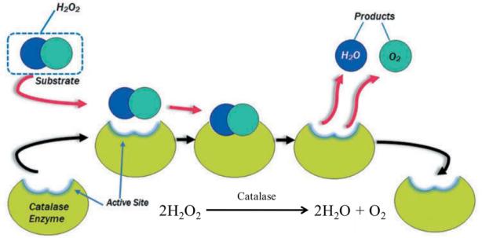
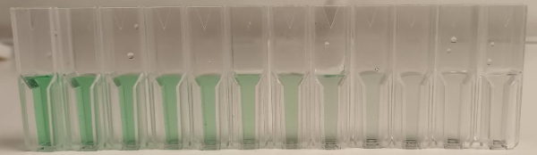

## Catalase measurement in permeabilized yeast cells

Catalase is an enzyme that catalyzes the breakdown of hydrogen peroxide to water and oxygen.

Figure 1

The aim of this practical class is to measure the activity of catalase in permeabilized [*Saccharomyces cerevisiae*](https://en.wikipedia.org/wiki/Saccharomyces_cerevisiae) yeast cells.

## Background

Acyl-CoA oxidase is the first enzyme in the peroxisomal β-oxidation pathway, responsible for catalyzing the oxidation of acyl-CoA, a process that breaks down fatty acids.

![[catalase lab-20241030065447199.png]]

Figure 2

Unlike in mitochondria, where FADH₂ would enter the electron transport chain, peroxisomal FADH₂ directly donates its electrons to molecular oxygen, leading to the formation
of hydrogen peroxide (H₂O₂) instead (Figure 2). This step is unique to peroxisomal β-oxidation since, in mitochondria, electron carriers like FADH₂ contribute to ATP synthesis through oxidative phosphorylation. In peroxisomes, however, FADH₂ is quickly oxidized back to FAD, enabling continuous fatty acid oxidation but producing H₂O₂ as a byproduct instead of ATP.

![[catalase lab-20241030065724928.png]]

Figure 3

Complex I and III can inadvertently leak electrons to molecular oxygen (Figure 3), forming superoxide. The superoxide anion (O₂⁻•​) generated in Complex I and III of the mitochondrial electron transport chain is detoxified primarily by the enzyme **superoxide dismutase (SOD)**.

![[catalase lab-20241030070256864.png]]

Figure 4

NOX1 and NOX2 are enzymes that belong to the NADPH oxidase (NOX) family, which play crucial roles in producing reactive oxygen species (ROS) as part of cell signaling and immune responses (Figure 4). Unlike mitochondrial ROS generation, these enzymes generate ROS directly at the cell membrane or within specific cellular compartments.

### NOX1

- **Location**: Primarily expressed in epithelial cells, including those in the colon and vascular smooth muscle cells.
- **Function**: NOX1 generates superoxide (O₂⁻•), which can be converted into other ROS, such as hydrogen peroxide (H₂O₂).
- **Role in Cellular Function**: Involved in cell signaling related to cell proliferation, migration, and immune responses. NOX1 is also implicated in vascular remodeling, inflammatory responses, and some forms of cancer progression, where ROS play a role in cell growth signaling.

### NOX2

- **Location**: Most well-known for its role in phagocytic cells (like neutrophils and macrophages), but it is also expressed in other cell types.
- **Function**: NOX2 is crucial for the immune response, as it produces superoxide in phagosomes to destroy ingested pathogens. Superoxide generated by NOX2 contributes to the “respiratory burst,” a rapid release of ROS that kills bacteria and other pathogens.
- **Role in Host Defense**: NOX2-derived ROS are critical in antimicrobial defense. Inherited defects in NOX2 lead to impaired ability to fight off infections.

![[catalase lab-20241030070651789.png]]

Figure 5

Glutathione (GSH) removes hydrogen peroxide (H₂O₂) through an enzymatic reaction involving **glutathione peroxidase (GPx)** (Figure 5).
This enzyme catalyzes the reduction of H₂O₂ to water, using glutathione as the electron donor.

1. **Reduction of Hydrogen Peroxide**: Glutathione peroxidase uses two molecules of reduced glutathione (GSH) to convert hydrogen peroxide into water. GSH is oxidized to form glutathione disulfide (GSSG).
2. **Regeneration of Glutathione**:  To maintain a steady supply of reduced glutathione (GSH), **glutathione reductase (GR)** recycles GSSG back to GSH using NADPH as a reducing agent:

### The catalase tes

Figure 6

The catalase test is a simple biochemical assay used to identify organisms capable of producing the enzyme catalase. All known aerobic microorganisms produce catalase. In the test (Figure 6), a small amount of bacterial culture is exposed to hydrogen peroxide, and the presence of bubbles indicates a **positive** result, signifying catalase activity. This test is commonly used to differentiate between catalase-positive organisms, like *Staphylococcus* spp., and catalase-negative organisms, such as *Streptococcus* spp. in clinical microbiology.

## Assay

The protocol is based on a combination of a method for preparing permeabilized yeast cells with ethanol described by [Trawczyńska & Wójcik 2015](https://pubmed.ncbi.nlm.nih.gov/26019618/)
and an assay for peroxide using cobalt ions described by [Hadwan 2018](https://bmcbiochem.biomedcentral.com/articles/10.1186/s12858-018-0097-5).

After the cells have been permeabilized, substrate such as H2O2 can more easily reach the catalase enzyme and the products (H2O and O2) can
more easily leave (Figure 7).

![[permyeast2.png]]

Figure 7

The permeabilization protocol is very simple. The yeast cells are incubated with ethanol for 20 min in a phosphate buffer.

Permeabilized yeast cells are mixed with hydrogen peroxide and incubated for 10 min at 37°C.  During this time some of the hydrogen peroxide is consumed by catalase and broken down to oxygen and water.

The remaining peroxide is measured by allowing the hydrogen peroxide to oxidize cobalt(II) to cobalt(III) which can be measured with a spectrophotometer at 440 nm (Figure 8).
The oxidation is performed in the presence of carbonate ions which causes a pink complex with cobalt(II) and a green complex with cobalt(III).

![[cobalt2-3.png]]
Figure 8

# Day 1 strain cultivation on solid medium

Streak the two strains below on solid YPD medium and incubate at 30 °C for ~48 h.

| Strain number | Strain designation | Plasmid vector        |                                                                  | box     | pos |
| ------------- | ------------------ | --------------------- | ---------------------------------------------------------------- | ------- | --- |
| µ1886         | CENPK111-32D       | pTA1                  | empty vector                                                     | Björn12 | 35  |
| µ1885         | "                  | pTA1_TDH3_ScCTT1_PGI1 | [CTT1](https://www.yeastgenome.org/locus/CTT1) expression vector | ""      | 34  |
# Day 3 pre-culture

Inoculate two 50 mL glass tubes os small Erlenmeyers with ~5 mL of SD medium and incubate at 30 °C with shaking for ~48 h.
Label the tubes 1885 and 1886, respectively. These cultures can be kept at 4-8°C in a fridge for for ~3-4 weeks.
# Day 7 preparation

This should be done in the morning the day before the class. Inoculate two 50 mL glass tubes with 5 mL of the same medium using 100 µL of each pre-culture.
Label the tubes with 1885 and 1886.

#  Day 8 class

Prepare 10 mL Hydrogen peroxide solution (10 mM) by adding 12 µL of 30% hydrogen peroxide to 10 ml of 50 mM phosphate buffer (pH 7.0). Pour ~1 mL of the Hydrogen peroxide solution in four Eppendorf tubes, one for each group.

Measure the optical density (OD) at 640 nm for the cultures. Add fresh medium to the culture with the higher OD in order to set the two cultures to the same optical density.

Prepare 50 mL **Working solution**. The order in which these components are added is **important**:

1. 2.5 ml of cobalt (II) solution (3 x 834 µL)
2. 2.5 ml of Graham salt solution (3 x 834 µL)
3. 45 ml of sodium bicarbonate solution. (Fill  x 834 µL)

Pour 5-10 mL of working solution into four 50 mL FALCON tubes, one for each group.
This solution should be stored at room temperature in the **dark**.

## Protocol for permeabilization of yeast with ethanol.

| Group | Strain number | Strain designation | Plasmid vector        |
| ----- | ------------- | ------------------ | --------------------- |
| 1     | µ1886         | CENPK111-32D       | pTA1 (empty vector)   |
| 2     | "             | "                  | "                     |
| 3     | µ1885         | "                  | pTA1_TDH3_ScCTT1_PGI1 |
| 4     | "             | "                  | "                     |

1. Each group (G1, G2, G3 and G4) should take out 1 mL of the culture indicated in the table above in an empty 1.5 mL Eppendorf tube.
2. Centrifuge 🌀 the culture for 20 s in a microcentrifuge.
3. Remove supernatant with a P1000 pipette.
4. Add 1 mL 5 mM phosphate buffer.
5. Resuspend cells by pipetting up&down with the same tip.
6. Centrifuge 🌀 culture for 20 s.
7. Remove supernatant.
8. Add 1 mL 5 mM phosphate buffer.
9. Resuspend cells.
10. Transfer 100 µL of the cells to a **new** Eppendorf tube.
11. Add 400 µL dH2O.
12. Add 500 µL absolute ethanol.
13. Mix the content of the tube by vortexing for ~30s.
14. Incubate for 20 min @ room temperature on the bench.
15. Mark nine empty Eppendorf tubes with a marker, **Sa**,  **Sb**, **Sc**, **T1a**, **T1b**, **T1c**, **T2a**, **T2b**, and **T2c**
16. Mark nine empty plastic [[cuvette\|cuvettes]] in the same way.
17. [☕](https://youtu.be/TwY6Hp5RYvI) break until cells are ready. The timing is not critical.

## Protocol for measuring catalase activity

18.  Add the components in the table to the marked tubes. Volumes are indicated in micro liters (µL). Prepare the tubes in the **indicated** order top to bottom, add components in the indicated order, left to right. Remember that after the addition of Peroxide, the reaction starts, so make this addition rapidly for all tubes.

| Label | Sample   | Water | Cells | Peroxide | Total |
| ----- | -------- | ----- | ----- | -------- | ----- |
|       |          |       |       |          |       |
| Sa    | Standard | 70    | 0     | 140      | 210   |
| Sb    | Standard | 70    | 0     | 140      | 210   |
| Sc    | Standard | 70    | 0     | 140      | 210   |
|       |          |       |       |          |       |
| T1a   | Test 1a  | 0     | 70    | 140      | 210   |
| T1b   | Test 1b  | 0     | 70    | 140      | 210   |
| T1c   | Test 1c  | 0     | 70    | 140      | 210   |
|       |          |       |       |          |       |
| T2a   | Test 2a  | 35    | 35    | 140      | 210   |
| T2b   | Test 2b  | 35    | 35    | 140      | 210   |
| T2c   | Test 2c  | 35    | 35    | 140      | 210   |

19. Incubate Eppendorf tubes at 🌡️37 °C in a water bath 🛁 for 10 min. ⏱️ **This timing is critical!**
20. Add 800 µL working solution to each tube.
21. Mix by inversion.
22. Incubate at room temperature for at least 10 min in the dark 🌙. You can put the tubes in one of the empty drawers in the lab.
23. Centrifuge 🌀 for 20 s at top speed.
24. Transfer supernatants to the cuvettes with the same marking. Take a picture 📷 of the cuvettes with your phone, upload to Google photos ![[catalase lab-20241030141408936.png]].
25. Record the absorbance for each cuvette at 440 nm against air. Position the cuvette as per the instructions for the [[GENESYS20]] spectrophotometer.
26. Add the data to the Google Spreadsheet ![[catalase lab-20241030143806102.png]].

## References:

This practical class was based on a combination of methods described in the two publications below:

Trawczyńska, I., & Wójcik, M. (2015). Optimization of permeabilization process
of yeast cells for catalase activity using response surface methodology.
Biotechnology, Biotechnological Equipment, 29(1), 72–77. [link](https://www.ncbi.nlm.nih.gov/pmc/articles/PMC4434045/)

Hadwan, M. H. (2018). Simple spectrophotometric assay for measuring catalase
activity in biological tissues. BMC Biochemistry, 19(1), 7. [link](https://bmcbiochem.biomedcentral.com/articles/10.1186/s12858-018-0097-5)

## Other references of interest:

Kaplan, J. G. (1963). THE REVERSION OF CATALASE DURING GROWTH OF YEAST IN ANAEROBIOSIS.
The Journal of General Physiology, 47, 103–115. [link](https://pubmed.ncbi.nlm.nih.gov/14060440/)

Martins, D., & English, A. M. (2014). Catalase activity is stimulated by H(2)O(2) in rich culture medium and
is required for H(2)O(2) resistance and adaptation in yeast. Redox Biology, 2, 308–313. [link](https://pubmed.ncbi.nlm.nih.gov/24563848/)

## How to calculate catalase activity

All absorbance values are taken with a spectrophotometer calibrated against air *without* a [[cuvette]] (Figure 10).

The **S**tandard reaction in Figure 9 contains only hydrogen peroxide and and cobalt(II) carbonate. All of the available peroxide should oxidize cobalt(II) to cobalt(III). The **T**est reactions contain H2O2 and cells. Some of the peroxide should have been consumed by the catalase in the cells, so the absorbance value at 440 nm should be lower than for the **S**tandard reaction.
$$\Delta A =  \boldsymbol{S}tandard_{Abs440nm} - \boldsymbol{T}est_{Abs440nm}$$
The absorbance that we should have observed for the consumed H₂O₂ is the absorbance for the **S**tandard reaction minus the absorbance of the **T**est reaction. We would expect a higher absorbance for the Test 2 reaction, since less cells should have consumed less peroxide.

![[catalase lab-20241030134016670.png]]

Figure 9

We use a standard curve (Figure 10) to calculate the actual concentration of the samples. The activity is then calculated from the concentration difference between the Standard and the sample divided by the reaction time.
## Calibration curve

Figure 10

A 10 mM hydrogen peroxide solution was [serially diluted](https://microbenotes.com/serial-dilution/#serial-dilution-formulacalculations) (Figure 11) by first preparing twelve Eppendorf tubes with 300 µL of [[ddH2O]]. One milliliter hydrogen peroxide was transferred to the first tube, the contents were mixed by pipetting up and down 5-6 times followed by transferring 1 mL to the next tube. This means that the last tube (12) eventually had a final volume of 1.3 ,L while all preceding tubes had 300 µL.

The hydrogen peroxide concentration in the first tube is 1 mL * 10 mM/1.3 mL = 7.6923 mM. The dilution factor is the same for all tubes (1/1.3) so the concentration of each tube can be calculated using the formula $10 \times (\frac{1}{1.3})^n$ where n is 1..12.

Figure 11

Cuvettes with  210 µL of each dilution were prepared, twelve in total. Working solution (800 µL)  (Series#1 and #2 below, Figure 12) was added to each cuvette followed by 10 min incubation at room temperature under darkness. Two replicates were prepared and the absorbance at 440 nm was measured with a [[GENESYS20]] spectrophotometer.
## Series#1

## Series#2

Figure 12

The absorbance readings were collected in the table below.

| Tube | Concentration (mM) | Series#1 | Series#2 |
|------|---------------|----------|----------|
| 1    | 7.692         | 0.450    | 0.414    |
| 2    | 5.917         | 0.394    | 0.361    |
| 3    | 4.551         | 0.345    | 0.307    |
| 4    | 3.501         | 0.291    | 0.263    |
| 5    | 2.693         | 0.248    | 0.225    |
| 6    | 2.072         | 0.213    | 0.194    |
| 7    | 1.594         | 0.197    | 0.166    |
| 8    | 1.226         | 0.160    | 0.148    |
| 9    | 0.943         | 0.143    | 0.134    |
| 10   | 0.725         | 0.123    | 0.115    |
| 11   | 0.558         | 0.109    | 0.113    |
| 12   | 0.429         | 0.113    | 0.095    |

The average absorbance was plotted against the hydrogen peroxide concentration resulting in a reasonably linear relationship (Figure 10). The graph follows the linear relationship between Concentration (mM) and A440:
$$C _{mm} = 20.8  \times A _{440} - 1.95$$

At this point, we have absorbance change or ∆A per 10 min. What we want is µmol / min which is the definition of the [[enzyme activity\|classical unit]].

## Linearity

The protocol specifies two experiments (Figure 6), **T**est**1** and **T**est**2**, where the latter contain half as much cells. If the assay is [[enzyme activity\|linear]], **T**est**1** should produce twice the absorbance compared to **T**est**2**.

![[catalase-assay-linearity.png]]

Figure 13

## Material 🇬🇧

dH2O 4 x 40 mL

### 100 mL liquid SD (Synthetic Defined) medium
- 6.7 g/L Yeast Nitrogen Base (YNB) WITHOUT AMINO ACIDS
- 20  g/L glucose

10 x 50 mL glass culture tubes with cotton stopper or aluminium cap

25 mL Ethanol 95-99% (2 courses * 3 shifts * 4 groups  * 0.5 mL = 12 mL)

Six empty new FALCON tubes 50 mL

### 250 mL 50 mM phosphate buffer (pH 7.0)
This buffer can be prepared by by mixing two solutions in ultrapure water:
- 100 mL 6.81 g/L KH2PO4
- 100 mL 8.90 g/L K2HPO4

### 300 mL [Sodium bicarbonate (NaHCO3)](https://pubchem.ncbi.nlm.nih.gov/compound/Sodium-Bicarbonate) solution
Prepared by dissolving 24 g (MW 84.01 g/mol) in 300 ml ultrapure water. This solution should be stored at **room** temperature.
### 25 mL Cobalt (II) solution
Prepared by dissolving 0.51 g of [Co(NO3)2 x 6H2O](https://pubchem.ncbi.nlm.nih.gov/compound/Cobalt_II_-nitrate-hexahydrate) in 25 ml of distilled water. This solution should be stored at **room** temperature in the **dark**.
### 25 mL Graham salt (Sodium hexametaphosphate) solution
Prepared by dissolving 0.25 g of (NaPO3)6 in 25 ml of distilled water. This solution should be stored at **room** temperature.
### 0.5 mL Hydrogen peroxide solution 30%

- Eppendorf tubes 1.5 mL (new, not sterile)
- Blue tips
- Yellow tips
- Plastic cuvettes

## Equipmen
- 37 °C water bath
- boat for cuvettes
- microcentrifuge
- vortex
- P1000 pipettes
- P200 pipettes

## Preparação 🇵🇹
# Dia 1 Cultivo de estirpes em meio sólido

Estriar as duas estirpes abaixo em meio sólido YPD e incubar a 30 °C por ~48 h.

| Número da Estirpe | Designação da Estirpe | Vetor Plasmídeo          |                                                                  | caixa   | pos |
| ----------------- | --------------------- | ------------------------- | ---------------------------------------------------------------- | ------- | --- |
| µ1886             | CENPK111-32D          | pTA1                      | vetor vazio                                                      | Björn12 | 35  |
| µ1885             | "                     | pTA1_TDH3_ScCTT1_PGI1     | vetor de expressão [CTT1](https://www.yeastgenome.org/locus/CTT1) | ""      | 34  |

# Pré-cultura do Dia 3

Inocular dois tubos de vidro de 50 mL com ~5 mL de meio SD e incubar a 30 °C por ~48 h.
Rotular os tubos 5 e 6 para µ1885 e µ1886, respetivamente. Estas culturas podem ser mantidas a 4-8°C no frigorífico durante ~3-4 semanas.

# Preparação do Dia 7

Esta etapa deve ser realizada na manhã do dia anterior à aula. Inocular dois tubos de vidro de 50 mL com 5-10 mL do mesmo meio usando 100 µL de cada pré-cultura. Rotular os tubos com 5 ou 6.

## Material 🇵🇹

### 100 mL de meio líquido SD (Synthetic Defined)
- 6,7 g/L de Base de Nitrogénio de Levedura (YNB) SEM AMINOÁCIDOS
- 20 g/L de glicose

10 x 50 mL tubos de cultura de vidro com rolha de algodão ou tampa de alumínio

25 mL de Etanol 95-99% (2 cursos * 3 turnos * 4 grupos * 0,5 mL = 12 mL)

Seis tubos FALCON novos e vazios de 50 mL

### 250 mL de tampão fosfato 50 mM (pH 7,0)
Este tampão pode ser preparado misturando duas soluções em água ultrapura:
- 100 mL de 6,81 g/L de KH2PO4
- 150 mL de 8,90 g/L de Na2HPO4

### 300 mL de solução de [Bicarbonato de Sódio (NaHCO3)](https://pubchem.ncbi.nlm.nih.gov/compound/Sodium-Bicarbonate)
Preparada dissolvendo 24 g (PM 84,01 g/mol) em 300 mL de água ultrapura. Esta solução deve ser armazenada à **temperatura ambiente**.
### 25 mL de solução de Cobalto (II)
Preparada dissolvendo 0,51 g de [Co(NO3)2 x 6H2O](https://pubchem.ncbi.nlm.nih.gov/compound/Cobalt_II_-nitrate-hexahydrate) em 25 mL de água destilada. Esta solução deve ser armazenada à **temperatura ambiente** no **escuro**.
### 25 mL de solução de sal de Graham (Hexametafosfato de Sódio)
Preparada dissolvendo 0,25 g de (NaPO3)6 em 25 mL de água destilada. Esta solução deve ser armazenada à **temperatura ambiente**.
### 0,5 mL de solução de Peróxido de Hidrogénio a 30%

- Tubos Eppendorf de 1,5 mL (novos, não estéreis)
- Pontas azuis
- Pontas amarelas
- Cuvetes de plástico

## Equipamento

- Banho-maria a 37 °C
- Barcos para tubos
- Microcentrífuga
- Vórtex
- Pipetas P1000
- Pipetas P200
