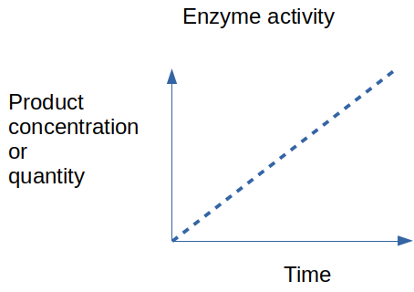
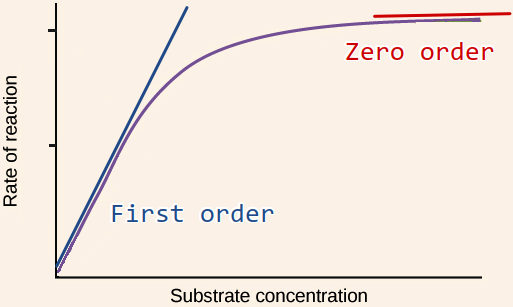

The metabolism consists of a network of enzymes that carry out [[anabolic]] and [[catabolic]] reactions.  Enzymes are catalysts, which means that they speed up slow chemical reactions. Enzymes do this by lowering the activation energy or the reaction (Figure 1).

Figure 1

Enzymes are dynamic can be regulated i.e. they can receive signals to speed or slow down. This regulation is the foundation for cellular [[homeostasis]] which is the cells ability to balance the rate of chemical reactions to provide energy, building blocks and a stable environment.

Enzyme activity is defined as the amount of product formed or substrate consumed within a distinct amount of time.

This is the same definition as for reaction rate (reaction velocity) in chemistry. A common unit is the classical **enzyme activity unit**. This is normally defined as **1 µmol substrate consumed (or product produced) per minute**. There is a  SI unit called [katal](https://bitesizebio.com/24702/catalyzing-through-confusion-making-some-sense-of-enzyme-units/) . One U (unit) correspondents to 16.67 nanokatals (nkat), but we stick with the classical unit for now.

The simplest way to measure enzyme activity is by mixing enzyme and substrate in a test tube and observe the **rate** of product formation.

Figure 2

Enzyme activity depend on many factors, the most important **enzyme concentration**, **substrate concentration** and **temperature**. The temperature is important for the same reason as for chemical reactions in general. We measure activity at the temperature at which the enzyme optimally operates (often 37°C for human enzymes).

Figure 3

If we make many different experiments where we mix a **fixed** concentration of enzyme with **increasing** concentrations of substrate and measure the reaction rate for a short time (*initial reaction rate*), and plot the rates against substrate concentration we often observe a saturation curve as above. This curve is described by the [Michaelis-Menten kinetics](https://www.khanacademy.org/science/ap-biology/cellular-energetics/environmental-impacts-on-enzyme-function/a/basics-of-enzyme-kinetics-graphs) [video 7m32s](https://www.khanacademy.org/test-prep/mcat/biomolecules/enzyme-kinetics/v/steady-states-and-the-michaelis-menten-equation).

Note that the variable on the **x**-axis is substrate concentration (**not time !**) and the variable on the **y**-axis is reaction *rate* for instance µmol/min.

In the first order region, reaction rate depends linearly on **substrate concentration** just as for a first order chemical reaction. In the zero order region, reaction rate is not affected by substrate concentration but only by the amount of enzyme.

We can understand this as all the enzymes being busy working at high substrate concentration and more substrate will not speed up the reaction.

This kind of analysis is important in order to determine the kinetic properties of an enzyme such as Km and Vmax.

If we want to discover the amount of enzymes contained in a sample i.e activity, it is important to set up the reaction so that the reaction rate **only** depends on the amount of enzyme.

This means that we should always work with high substrate concentrations so that the enzyme is always in the zero order reaction rate region.

## The stopped assay

The simplest enzymatic assay is the "stopped assay" where we measure the progress of the reaction only once after a specified amount of time. The name comes from the stopping of the enzyme reaction after a specific time so that the reaction product can be measured later.

The advantage of the stopped assay is simplicity and that it might be easier to process many samples at simultaneously. Continuous measurement of enzume activity can be done using specialized equipment.

Figure 4

The red line in Figure 4 represents a typical reaction progressing. Note that this curve show some similarities to the curve in Figure 3, but they show two **very different things**. In Figure 4, the variable on the x-axis is time. The y-axis shows **concentration** or **quantity** of product formed or substrate consumed.

The red dots symbolize a measurements. As long as the reaction is in the zero-order region (Figure 3) the reaction proceeds linearly (white part of the figure). After some time, the substrate concentration is reduced so that the reaction rate slows down as it is no longer only dependent on the enzyme concentration, but also the substrate concentration (gray part of the figure). The reaction can also slow down due to build up of reaction product.

It is obvious from the picture that it is critical to keep the assay in the linear region or we will underestimate the reaction rate.

In practical terms, how do we know that the assay is in the linear region. The simplest verification is to measure two different enzyme concentrations. If the assay is in the linear region, half as much enzyme, for example, should give 50% of the activity.

## References

Bisswanger, H. (2014). Enzyme assays. Perspectives in Science, 1(1), 41–55.

Bisswanger, H. (2011). Practical Enzymology (2., vollständig überarbeitete Auflage.). Wiley.