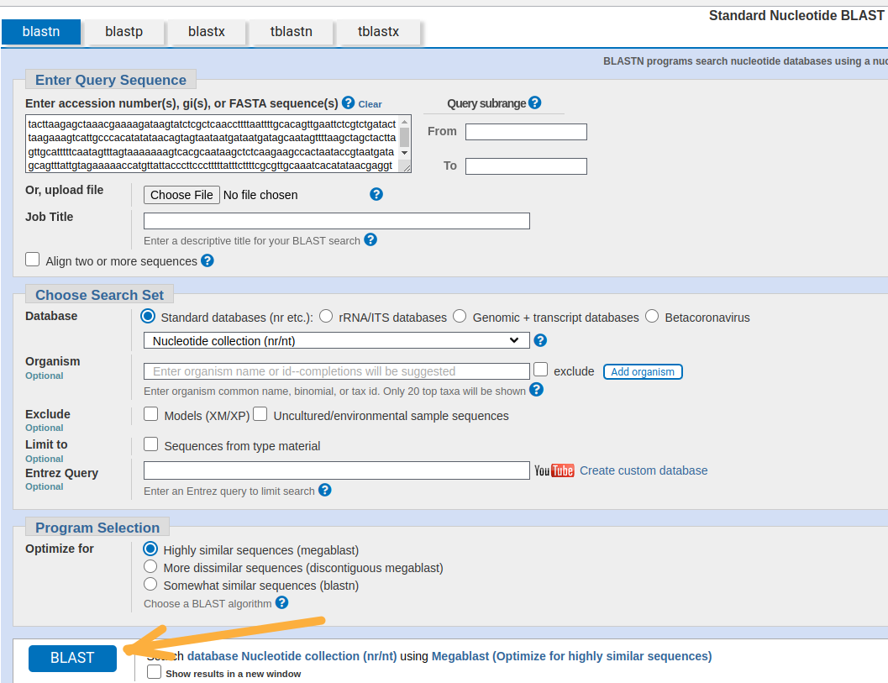
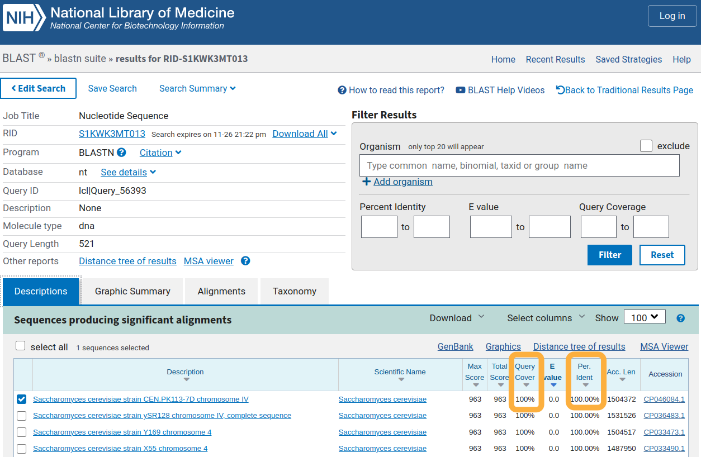
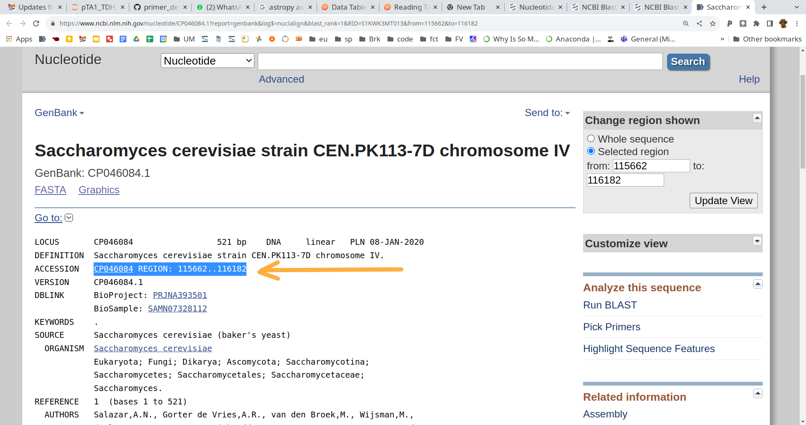
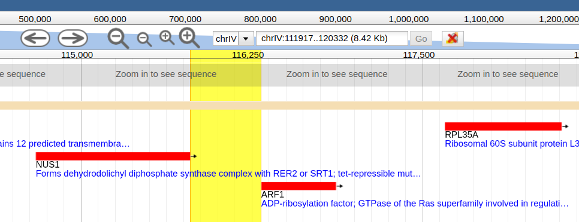

This instruction shows the steps to obtain a Genbank reference for a sequence.

A prerequisite is of course that the sequence is already in the Genbank database.

It is good to have this reference to avoid copy-paste errors, since database sequences might be updated in the future.

We will use the sequence below as an example.

Copy the sequence to the clipboard and go to Genbank [BLAST](https://blast.ncbi.nlm.nih.gov/Blast.cgi?PROGRAM=blastn&PAGE_TYPE=BlastSearch&LINK_LOC=blasthome).

	>unknown_sequence
	TACTTAAGAGCTAAACGAAAAGATAAGTATCTCGCTCAACCTTTTAATTTTGCACAGTTGAATTCTCGTC
	TGATACTTAAGAAAGTCATTGCCCACATATATAACAGTAGTAATAATGATAATGATAGCAATAGTTTTAA
	GCTAGCTACTTAGTTGCATTTTTCAATAGTTTAGTAAAAAAAGTCACGCAATAAGCTCTCAAGAAGCCAC
	TAATACCGTAATGATAGCAGTTTATTGTAGAAAAACCATGTTATTACCCTTCCCTTTTTATTTCTTTTCG
	CGTTGCAAATCACATATAACGAGGTGGCTTGTATTTGTCAAACCAAAAAAAAAAATGAAAATCGAAAAAT
	GGAAAAACAGAGAGAGAAACGGAATCTTTGACACGTTCTCGATCCACTTGTTTATCGAGGTGGTTTTTAT
	AAGTCTTACTAGATAGAAAGTTCATTTTGTTTTGAAACTTTTTGGAACCTCTGGCATTGAAGGTATAAGA
	AAGAACTCAAACAGGTTTAATAGAATTAAAA

Paste the sequence in the main text area and click the blue **BLAST** button to start the search.

Look at the first result, which is the one with the highest E-value. This result **must** have 100% "Query Cover" **and**
100% identity (Per. ident). If either of these are not 100%, the sequence you are searching for is not present in the database.

Click on the "Alignments" button.

Click on the "Genbank" button.

The genbank reference is the text after the "ACCESSION" keyword. Copy this and store for future reference.

This format "CP046084 REGION: 115662..116182" is compatible with later versions of
[ypkpathway](https://github.com/BjornFJohansson/ypkpathway#-ypkpathway) and
the [`genbank`](https://pydna.readthedocs.io/#module-pydna.genbank) function in pydna