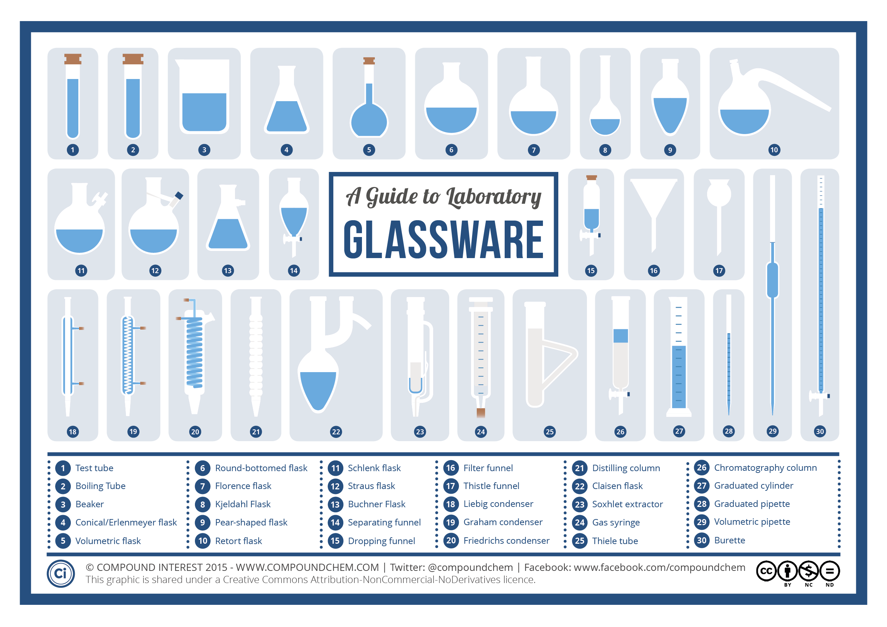

 Picture from [here](https://www.compoundchem.com/2015/03/17/glassware).

English terms for [Basic Laboratory Glassware and Equipment](https://www.acs.org/content/acs/en/chemical-safety/guidelines-for-chemical-laboratory-safety/resources-supporting-guidelines-for-chemical-laboratory-safety/basic-laboratory-glassware-and-equipment.html)

Schott bottles.

