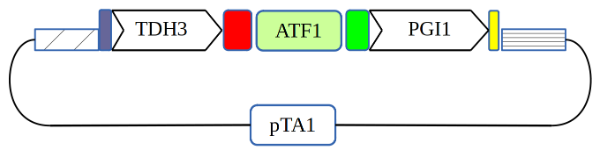

This document will show you how to assemble an expression vector called `pTA1_TDH3_ScATF1_PGI1` using the [[The Yeast Pathway Kit\|Yeast Pathway Kit]].

This vector is a combination of:

- A strong TDH3/[YBR192C](https://www.yeastgenome.org/locus/YGR192C) promoter from the *S. cerevisiae* glyceraldehyde-3-phosphate dehydrogenase (GAPDH),
- The ATF1 gene from the pYPKa_A_ATF1 plasmid
- A terminator consisting of the phosphoglucose isomerase (PGI1/[YBR196C](https://www.yeastgenome.org/locus/YBR196C)) upstream intergenic sequence.
- A pTA1 vector. The pTA1 vector provides s**election markers** and **origin of replication**.

## Prepare sequences

The first step is to collect all sequences needed for the assembly. For a Yeast Pathway Kit single gene expression TU vector, this means:

1. A **linear** plasmid sequence
2. A promoter PCR produc
3. A gene PCR produc
4. A terminator PCR produc

### 1. Linearize vector

The pTA1 vector is available [here](https://github.com/MetabolicEngineeringGroupCBMA/YeastPathwayKit/blob/master/sequences/pTA1.gb). It should be linearized using the [[ypk_restriction_enzymes\|ZraI]] restriction enzyme. Use the Enzymes>Enzyme selector to find the
cut location of this enzyme. The linear plasmid sequence can be obtained by using the ApE Edit>"_Linearize @ insert site_" [[ApE#How to linearize a circular sequence at a specific location.\|function]].

### 2. Obtain PCR product sequences

![[in silico assembly of pTA1_TDH3_ATF1_PGI1-20240926080600744.png]]

The PCR products can be obtained using [WebPCR](https://pydna.pythonanywhere.com/pcr) and the PCR primers indicated in the table below.

| Target     | Template                                                                                                               | Forward primer | Reverse primer |
| ---------- | ---------------------------------------------------------------------------------------------------------------------- | -------------- | -------------- |
| Promoter   | [pYPKa_Z_TDH3](https://github.com/MetabolicEngineeringGroupCBMA/YeastPathwayKit/blob/master/sequences/pYPKa_Z_TDH3.gb) | 577            | 567            |
| Gene       | [pYPKa_A_ATF1](in%20silico%20assembly%20of%20pYPKa_A_ATF1)                                                             | 468            | 467            |
| Terminator | [pYPKa_E_PGI1](https://github.com/MetabolicEngineeringGroupCBMA/YeastPathwayKit/blob/master/sequences/pYPKa_E_PGI1.gb) | 568            | 578            |
All primer sequences are available [here](standard_primers).

Collect the linear vector sequence and the three PCR product sequences in [[GenBank#fasta format\|FASTA format]] in a text editor such as Notepad like so:


![[fasta_sequence_list.png]]

### 3. Assembly using PydnaWeb

Paste the four sequences into the [Assembly simulator](https://pydna.pythonanywhere.com/assembly) tool:


![[in silico assembly of pTA1_TDH3_ATF1_PGI1-20240709183935399.png]]

Select circular assembly and click "submit". The result should yield a figure and a sequence for the assembly and for the reverse complement. The reverse complement sequence is a by-product of the algorithm used. The assembled sequence is marked by an orange line in the figure below.


![[in silico assembly of pTA1_TDH3_ATF1_PGI1-20240709184245074.png]]

The resulting sequence should be around 9646 bp and have a short seguid checksum `cdseguid=y6oBCE`

Compare the size and complete seguid checksum with that of your colleagues.


## Assembly using Colab

The assembly can also be done using pydna directly. For this exercise, we will use pydna and [google colab](https://colab.research.google.com) which you can use if you have a free google account.
Colab is a hosted Jupyter Notebook service that requires no setup.  A [Jupyter notebook](https://nbviewer.org) is a python program file that can also show comments and images as
well as intermediate results. Colab allows you to write and execute Python in your browser without installing any software.

Go to [Google colab](https://colab.research.google.com) in you web browser. Create a new notebook by clicking on the "New notebook button", see the image below:

![[new_colab_nb.png]]


Copy the code below into the first cell. This code will tell the python package manager [pip](https://pip.pypa.io/en/stable) to
install the [pydna](https://github.com/BjornFJohansson/pydna#readme) package which has the functionality we need.

```
!pip install pydna
```

Run the first cell by clicking the arrow button  and **wait** for the execution to finish (see below)).


![[run_first_cell.png]]


You can ignore the output from this cell.

----

Click on the  button to get a new code cell (see below):

![[new-cell.png]]

Copy the code below into the new cell and execute.

```
from pydna import logo
from pydna.parsers import parse
from pydna.assembly import Assembly
logo()
```

You should now have a printout of the pydna logo:

![[pydna_logo.png]]

----

Create a new code cell and paste the code below.
**Replace** the sequences with your own and execute. Make sure that you adhere to the [[GenBank\|FASTA]] sequence format.

```
sequences = """\

>pTA1 linear
replace-this-text-with-your-own-DNA-sequence

>promoter
replace-this-text-with-your-own-DNA-sequence

>gene
replace-this-text-with-your-own-DNA-sequence

>terminator
replace-this-text-with-your-own-DNA-sequence
"""
```


![[four_fasta_sequences.png]]


There should be no output from the code cell above.

----

Create a new code cell and paste the code below and execute.


```
linear_vector, promoter, gene, terminator = parse(sequences)
linear_vector, promoter, gene, terminator
```

For this example, you should have an output like the one below.

![[parse.png]]

----

```
asm = Assembly((linear_vector, promoter, gene, terminator))

candidates = asm.assemble_circular()

candidate, *rest = candidates

candidate.figure()
```

You should have a figure like this one as result:


![[pydna_assembly_figure.png]]

----


Create a new code cell, paste the code below and execute.


```
result = candidate.synced("gttctgatcctcgagcatcttaagaattc")

result.name = "pTA1_TDH3_ScATF1_PGI1" # Change this name as needed

print(result.format())
```

This should give you a sequence of the plasmid in Genbank format:


----

Create a new code cell and paste the code below and execute.


```
result.seguid()
```


Compare the sequence length and seguid code (short `cdseguid=y6oBCE` ) with the ones of your colleagues.
