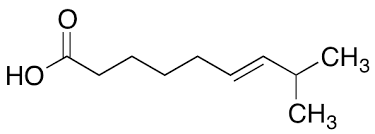

---
{"publish":true,"title":"Metabolic Engineering CBMA","created":"2026-01-08T12:03:47.148+00:00","modified":"2026-01-14T08:36:33.839+00:00","cssclasses":""}
---

We are the mec research group, a part of the research center [Centro de Biologia Molecular e Ambiental (CBMA)](https://cbma.uminho.pt). We are located in the [Department of Biology](https://goo.gl/maps/JyphLrwBYejffwTx5), [University of Minho](https://www.uminho.pt) in the ancient city of [Braga](https://en.wikipedia.org/wiki/Braga), Portugal.

- [[Teaching\|Teaching]] material
- [[people\|People & contacts]]
- Protocols other lab [[lab\|information]]

## Our interests

We are interested is metabolic engineering of baker's yeast [*Saccharomyces cerevisiae*](https://en.wikipedia.org/wiki/Saccharomyces_cerevisiae)
for consumption of new types of substrates and production of new biotechnologically interesting molecules. You can see this yeast growing under a microscope in the animated image above.

Specifically, we work on expanding the consumption of for efficient metabolism of new types of sugars as [D-xylose](https://en.wikipedia.org/wiki/Xylose) combined with biosynthesis of [fatty acids](https://en.wikipedia.org/wiki/Fatty_acid) and derived lipids.

This process is important in nature, since fatty acids make up significant parts of fundamental structures such as cell membranes, but also serve as
efficient energy storage for many cells and organisms.

The process could potentially be used for the green production of fuels or specialized chemicals in a future [green economy](https://en.wikipedia.org/wiki/Green_economy).

## Tools

As the genetic modifications performed in the scope of metabolic engineering grow more complex, there is a need for new tools to facilitate different aspects of the overall process to increase throughput and maintain precision.

### Yeast Pathway Kit

We have developed a metabolic pathway assembly method we call the [**Yeast Pathway Kit**](https://pubmed.ncbi.nlm.nih.gov/26916955), that produces compact metabolic pathways for a given number of genes compared to other methods.

It relies on one library of promoters and another for terminators. Pathways are joined together by first making a set of single gene expression vectors by homologous recombination. The promoter-gene-terminator fragments (or transcriptional units) can then be stitched together by a second round of homologous recombination (see the figure below):

### pydna

![[pydna_logo_resized.png]]

[`pydna`](https://github.com/BjornFJohansson/pydna#-pydna) is a python package that facilitate "programming with DNA" or expressing cloning strategies as a computer program. This can be used for automating cloning in a high throughput environment. It can also be used to produce a automatically verifiable, complete description of virtually any deterministic genetic design procedure.

This can be powerful for high quality documentation in combination with `Jupyter` notebooks to provide both code and a readable document. See our Anaconda Maker
Series [blog post](https://www.anaconda.com/blog/why-is-so-much-cloning-documentation-wrong).

See our [software](https://github.com/MetabolicEngineeringGroupCBMA/MetabolicEngineeringGroupCBMA.github.io/wiki/software) wiki page for more information.

### Funding

We are grateful for funding from Fundação para a Ciência e Tecnologia ([FCT](https://www.fct.pt)):

- FatVal PTDC/EAM-AMB/032506/2017 funded by national funds through the FCT I.P. and by the ERDF through the COMPETE2020 – Programa Operacional Competitividade e Internacionalizacão (POCI).

- MycoFat: PTDC/AAC-AMB/120940/2010

and from the [Swedish Fulbright Commission](https://www.fulbright.se).

CBMA was supported by the strategic program UIDB/04050/2020 funded by national funds through the FCT I.P.
