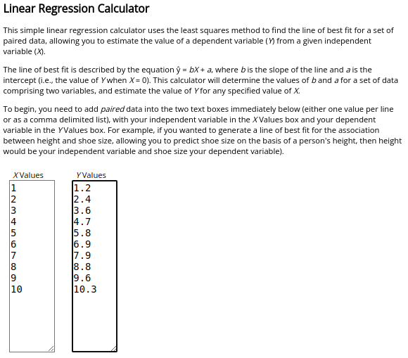

### Linear regression

There is an online tool [here](https://www.socscistatistics.com/tests/regression/default.aspx) called linear regression calculator which can be used to calculate the equation of a linear model of X/Y data pairs.

Spreadsheets like Excel or Google Spreadsheet has similar capabilities, but may be harder to use if you are not used to these tools.

For example, a line can be fitted to the data in the table below.

| X  |
|----|
| 1  |
| 2  |
| 3  |
| 4  |
| 5  |
| 6  |
| 7  |
| 8  |
| 9  |
| 10 |

| Y    |
|------|
| 1.2  |
| 2.4  |
| 3.6  |
| 4.7  |
| 5.8  |
| 6.9  |
| 7.9  |
| 8.8  |
| 9.6  |
| 10.3 |

Paste the X and Y data into the X-values and Y-values text windows.

Click the "Calculate the Regression Equation" button at the end of the page.

You will get a linear equation, in this case:

    y = 1.02424x + 0.48667

A diagram showing the fitted line and the datapoints:

And some statistics regarding the fit of the line:

