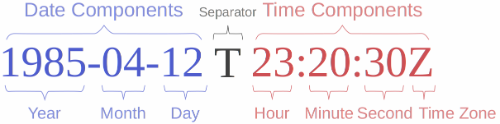

## How to maintain good laboratory notes

Keeping an accurate, complete and useful record of experiments, methods and data is an
integrated part of science. It is also one of the biggest challenges for most scientists.

Learning to keep a good notebook early will establish good habits that will serve you throughout your career, no matter what you do outside science.

Your notebook is a permanent chronological record of what you planned, did and observed in the laboratory. The notebook is:

1. An accurate account of factual details of experiments, including mistakes, thought experiments, ideas, etc.
2. A **complete** record of procedures, reagents, data, and interpretations and hypotheses.
3. Useful only if it is understandable by someone else than yourself.

The first point cannot be stressed enough. You should record all mistakes and difficulties performing an
 experiment. You may learn more from these failures, and your attempts to correct them, than from experimen
that works perfectly the first time.

### Use ISO 8601 date forma

Record dates in ISO 8601 format:

.

### Record early

Record as the work is performed on paper or on you computer. Record it as soon as possible, today
if possible! At the latest, record the next day!

Do a **weekly checkup** to make sure that all experimental conditions provided and all results recorded
(electronically or on paper).

### Mistakes/Errors

How to deal with mistakes? Never use white-out, erase or write-over. Never discard or replace attached supplementary data.

On paper:

- Draw a line through all errors.
- Record a reason for the correction/edi
- Add current date to the corrected/edited data.

In the electronic lab notebook, do the same thing by adding a comment and a date and offsetting the old tex
to the right with a tab.

A good test of your work is the following question:

**Could your colleague use your notebook to repeat your work?**

Could you come back six months later, read your notes, and make sense of them?

If you can answer yes to these two questions, you are keeping a good notebook.

### Organization

In the MEC group and in the LGM lab most people use:

- Benchling
- [Our wiki](https://github.com/MetabolicEngineeringGroupCBMA/MetabolicEngineeringGroupCBMA.github.io/wiki)
- Photos taken with a mobile phone saved to [Google photos](https://photos.google.com) or a similar service.

Be sure to back up your notes to dropbox or some similar service for safety.

### Good Practice:

When you first start a somewhat larger project such as the construction of a new vector, write
a couple of lines about the motivation and a simple outline of it, even if it seems obvious to you
at the time.

Invent a title for the project (one that may run over several days or weeks!) a good title
might be plasmid_name_ISO 8601_date such as for example pGOI_2019-01-04 for the construction of the fictional
"pGOI" plasmid that was started on the third of March in 2017.

This title should have no white space, this is makes it easier to make internal links.

Make the first entry like so:

Write a short description of the project. Use pydna in a Jupyter notebook to describe the cloning strategy. Do this early in the project to catch
possible strategy errors.

On day two, solid LB medium was made and a strain was streaked from the -80 freezer stock to prepare a plasmid for the project. A recipe on the MEC protocol wiki was used.
Generally, if a protocol exists on the MEC protocol wiki, refer to this by a hyperlink

On day three, The plasmid stock strain was observed to have grown normally and plasmid prep is performed using the cells on the plate. A picture was taken with a cell phone
to document the plate. A link to

On the page defined by the chosen title, the *mecplugins/here* function can be used to list all pages where the title was used.

### Continuation pages

What if you need more than one page for a project? The paper notebooks we use have one A4 page per day.
Simply add dated (ISO 8601!) blank pages to the notebook if needed.

### New procedures

For new procedures, create a protocol on a page of your personal wiki and refer to this.
If the protocol could be useful for others, add it to the MEC protocol wiki.
