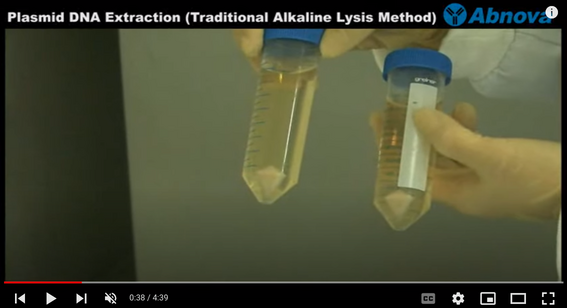

This protocol shows plasmid preparation from 100 mL
of [[Terrific Broth]] medium. This should also work with LB medium.

The solutions used are almost the same as the ones
used in the [[alkaline lysis plasmid mini prep\|minprep]] protocol.

These can most likely be used instead.