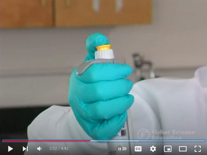
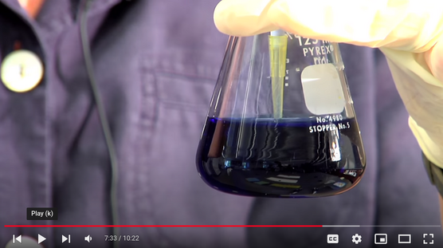

# Pipetting

Pipetting with both accuracy and precision is very important for a biologist.
It is also important to take car of the pipette.

1. Always pipette vertically and do not let liquid into the pipettes

2. Pipette slowly, especially if the liquid is viscous

3. Set the pipette to its maximum volume when not in use.

The three videos below give you a nice introduction to pipetting:

Pipetting: Basic Pipetting

Micropipette technique demo

Four Common Pipetting Errors - Techniques Demonstration

### Pipette calibration

Under a constant temperature and atmospheric pressure, the density of distilled water is constant.
The volume of water can be determined by weighting dispensed water.

1. Measure the water temperature and record it.

2. Place a plastic cup or a Petri dish on the balance and adjust the weight to zero.

3. Put a tip onto the pipette and set the volume which is to be tested.

4. Dispense a set volume of water. It is a good idea to calibrate both with a small and large volume:

| Model | Small volume (µL) | Large volume (µL) |
|-------|-------------------|-------------------|
|  P20  |         2         |         10        |
|  P200 |         20        |        100        |
| P1000 |        100        |        500        |

4. Close the door of the balance and record the weight after it has stabilized.

5. Repeat 10 times adjusting the balance to zero after each measurement.

6. Use [this form](https://docs.google.com/spreadsheets/d/1eqhkhCqclrUXF75M1uVdcez7PdsAuJ64UBSVO6MXB1Q/edit#gid=172131660&range=D1) to record and calculate precision and accuracy

