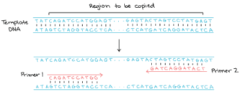
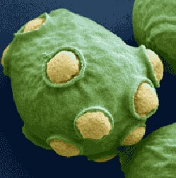

### Timing

We start work at **09:00** _sharp_, This makes the lab work more efficient as it is easier to communicate when everyone is at the same place at the same time. It is also easier to get started in the morning as the lab fills up quickly. If you can **not** make it to **09:00**, let us know in the WhatsApp chat.

### Join the WhatsApp group "LGM Laboratory"

![[practical_considerations_001.png]]

### Get an ORCID number

This is important for your future academic career. Get it [here](https://orcid.org). [This](https://en.wikipedia.org/wiki/ORCID) wikipedia entry explains what an ORCID is.

### Get a Google accoun

You will need a [google account](https://accounts.google.com/signup/v2/webcreateaccount?hl=en&flowName=GlifWebSignIn&flowEntry=SignUp) if you do not have one already. You also need this to access the primer and freezer lists and for booking the PCR machine.

### Get a Github accoun

We keep public genetic constructs in the [Metabolic Engineering Group at CBMA](https://github.com/MetabolicEngineeringGroupCBMA) Github organization. We keep private (not yet published) constructs in this private Github [repository](https://github.com/MetabolicEngineeringGroupCBMA/genetic-work-in-progress).

### Get organized
Please follow the guidelines regarding [[How to mark your material]] and [[maintaining lab notes]].

### Learn how to pipette fast and with precision
[[pipetting]] with both accuracy and precision is maybe the most important skill for any molecular or microbial biologist. Follow the [[pipetting\|instructions]] and be sure to follow the recommendations on use and care of the pipettes. Calibrate you P20 and P200 pipette using the instructions in order to verify both the pipette and you ability to use it.

### PCR primers

We keep a list of PCR primers [here](https://docs.google.com/document/d/1TfKUGfgoNLhM8fXh8LbT8TxDb_vpuViC37C-xepqJY8/edit).
When ordering new primers, add them to the top of this list and give them a number.

### Our PCR machine

You also need access to the [Biorad T100](https://calendar.google.com/calendar/u/0/r/settings/calendar/aDlmbW0wMWJjMW02dTk1N2FlbnY3dmI2ZmdAZ3JvdXAuY2FsZW5kYXIuZ29vZ2xlLmNvbQ) google calendar. We use this for booking the PCR machine in the lab. Book by adding your name and the time you want to use the machine:

### Autoclave

The autoclave is run three times per day (see [[autoclaving]]). There is no autoclave that we can run independently at this moment. Plan well for this since your work will be **delayed** otherwise.

### Saving your work

You will likely make new microbial strains or genetic constructs during your stay in the lab.
You need to save these in the -80°C freezer after they have been confirmed to be correct.
We keep a list of frozen strains in this google spreadsheet: [-80](https://docs.google.com/spreadsheets/d/1eqhkhCqclrUXF75M1uVdcez7PdsAuJ64UBSVO6MXB1Q/edit#gid=1901694203).
Please follow these instructions to freeze your strains: [[Yeast and bacterial freezer stocks]].

### Get to know your new friend

We work mostly with baker's yeast *Saccharomyces cerevisiae*. An enormous amount is known about this organism. _Getting Started With Yeast_ is a gentle introduction
written by Fred Sherman at the University of Rochester. [Sherman F. Getting started with yeast. Methods Enzymol 2002;350:3–41](https://www.ncbi.nlm.nih.gov/pubmed/12073320).
A [pdf](gswy.pdf) is available. Please read it to get more familiar with this fascinating organism. There are also usually copies available [online](https://www.google.com/search?as_q=sherman+getting+started+with+yeast+2002&as_epq=&as_oq=&as_eq=&as_nlo=&as_nhi=&lr=&cr=&as_qdr=all&as_sitesearch=&as_occt=any&safe=images&as_filetype=pdf&as_rights=)

In particular, we follow the [[Genetic nomenclature]] for _Saccharomyces cerevisiae_ defined in this document.

Record your frozen strains here: [MEC_freezer_list](https://docs.google.com/spreadsheets/d/1eqhkhCqclrUXF75M1uVdcez7PdsAuJ64UBSVO6MXB1Q/edit#gid=1901694203)

Location and names of all boxes in -80 freezer [DEEPFREEZER 8](https://docs.google.com/spreadsheets/d/1eqhkhCqclrUXF75M1uVdcez7PdsAuJ64UBSVO6MXB1Q/edit#gid=1467824477). This freezer is located next to the aquarium.

Define your initials in order to deposit in the -80°C freezer here: [Depositors](https://docs.google.com/spreadsheets/d/1eqhkhCqclrUXF75M1uVdcez7PdsAuJ64UBSVO6MXB1Q/edit#gid=912966047)

List of restriction and other enzymes [Enzymes_LGM](https://docs.google.com/spreadsheets/d/1eqhkhCqclrUXF75M1uVdcez7PdsAuJ64UBSVO6MXB1Q/edit#gid=52431770)

Please record [here](https://docs.google.com/spreadsheets/d/1eqhkhCqclrUXF75M1uVdcez7PdsAuJ64UBSVO6MXB1Q/edit#gid=964731213) when you make new competent cells. This is so that we can trace competency.

Please record [here](https://docs.google.com/spreadsheets/d/1eqhkhCqclrUXF75M1uVdcez7PdsAuJ64UBSVO6MXB1Q/edit#gid=176499668)  when you make new Taq polymerase.

Please record [here](https://docs.google.com/spreadsheets/d/1eqhkhCqclrUXF75M1uVdcez7PdsAuJ64UBSVO6MXB1Q/edit#gid=1457101389)  when you make new PennStateLadder.

Do you need a short name for your plasmid to write on the Eppendorf tube? Record it here and get a π number. You can for example call your plasmid π43 which is short and easy to search for on your computer [MECPlasmidNames](https://docs.google.com/spreadsheets/d/1eqhkhCqclrUXF75M1uVdcez7PdsAuJ64UBSVO6MXB1Q/edit#gid=1698645724)

These primers were used by the Yeast Genome Deletion project. There are errors in this table, make sure
to check primers before ordering [Yeast Genome Deletion Primers and PCR product Sizes](https://docs.google.com/spreadsheets/d/1pVlMkCKb6iX-w-2Q3OP2iP0UMH72PEHf9TuGM4SdRZk).

### Checklis

- [ ] Joined WhatsApp "LGM Laboratory" group
- [ ] ORCID
- [ ] Gmail accoun
- [ ] Joined the LGM Google spreadsheet (invite needed)
- [ ] Joined the Google doc Primer lis
- [ ] Joined the BIORAD T100 Google calendar
- [ ] Github accoun
