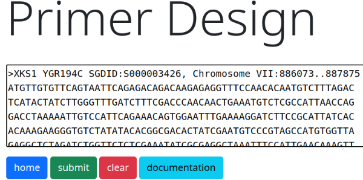
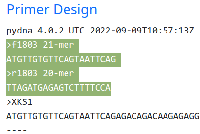

This document explains how to design a pair of PCR primers for a gene to be *expressed* in *S. cerevisiae*.
The example chosen is the *S.cerevisiae* [XKS1](https://www.yeastgenome.org/locus/S000003426) gene, but the general guidelines are applicable for any gene.
We assume that the DNA sequence for the open reading frame of the gene is available.
There are a number of important considerations, especially for heterologous genes.
## Introns

Does your gene have introns?  S. cerevisiae has a limited capacity to process introns. See [A broad analysis of splicing regulation in yeast using a large library of synthetic introns](https://journals.plos.org/plosgenetics/article?id=10.1371/journal.pgen.1009805) by Schirman et al. 2021. We have successfully expressed the Yarrowia lipolytica ACC1 gene containing introns [Pereira et al. 2022](https://www.sciencedirect.com/science/article/pii/S2001037022000277)

## Design primers automatically with the Primer designer tool of Pydnaweb.

Go to [Pydnaweb](http://pydna.pythonanywhere.com) and click in the "Primer designer" button. Replace the default sequence with your sequence, be sure to use use proper [[GenBank\|FASTA or GenBank]] format. In this example, the gene for *S. cerevisiae* xylulokinase [XKS1/YGR194C](https://www.yeastgenome.org/locus/S000003426) is used as an example below.



Click the `submit` button and copy the primers to your electronic lab book.



The next step is to consider modifications to the primers in order to maximize expression level of the gene. This might involve:

- adding a stabilizing amino acid codon between the start codon and the first amino acid codon.
- adding an efficient [Kozak](https://en.wikipedia.org/wiki/Kozak_consensus_sequence) sequence


```
>f1803 21-mer
ATGTTGTGTTCAGTAATTCAG
   |||
   LEU
```
## The N-end rule

The first amino acid in the protein in *Saccharomyces cerevisiae* is coded by the codon immediately after the start codon as the start codon is not translated. The first amino acid in the xylulokinase gene is **Leucine** which destabilizes the protein according to the N-end rule with a half-life of around 3 min. See [[Amino acids\|this table]] for amino acid properties including stabilization and preferred codons in _S. cerevisiae_.

A stabilizing amino acid such as glycine would on the other hand give a half life of >30 h.

We can stabilize the protein by adding a stabilizing amino acid, such as glycine,  before the first amino acid by modifying the forward primer. Glycine could be a good choice in most cases as it is small and not likely to affect protein function.

```
>f1803 21-mer
atgggtTTGTGTTCAGTAATTCAG
      |||
   glyLEU
```

This modification of the forward primer means that is does no longer bind as intended as
it not longer anneals perfectly on the 5' side. We can design a new pair of primers using the
Primer designer tool by removing the start codon.


```
>f1800 21-mer (new forward primer without start codon)
TTGTGTTCAGTAATTCAGAGA

>r1800 20-mer
TTAGATGAGAGTCTTTTCCA
```

We can see that the new forward primer ends three nucleotides downstream of the old one to compensate for the removal of the start codon.

We then add back the start codon and the glycine codon:

```
>f1800
atgggtTTGTGTTCAGTAATTCAGAGA

>r1800
TTAGATGAGAGTCTTTTCCA
```

## Kozak consensus sequence

The nucleotides immediately upstream of the start codon ([Kozak consensus sequence](https://en.wikipedia.org/wiki/Kozak_consensus_sequence)) affects protein translation efficiency in *S. cerevisiae*. [Xu et al. 2021](https://microbialcellfactories.biomedcentral.com/articles/10.1186/s12934-021-01641-z) found
that K528 (`tctgcaata`) was the most efficient among the sequences tested.

```
>f1800
tctgcaataatgggtTTGTGTTCAGTAATTCAGAGA
--K528---
         sta
            gly
```

The primer above has the K528 Kozak sequence, a start codon and a glycine codon followed
by the new primer sequence. The Pydnaweb [WebPCR](https://pydna.pythonanywhere.com/pcr) simulator can be used to find a suitable
PCR program for two kinds of DNA polymerases:


```
Forward: f1800 Reverse: r1800

               5TTGTGTTCAGTAATTCAGAGA...TGGAAAAGACTCTCATCTAA3
                                        ||||||||||||||||||||
                                       3ACCTTTTCTGAGAGTAGATT5
5tctgcaataatgggtTTGTGTTCAGTAATTCAGAGA3
                |||||||||||||||||||||
               3AACACAAGTCATTAAGTCTCT...ACCTTTTCTGAGAGTAGATT5

Taq DNA pol
|95°C|95°C               |    |tmf:55.1
|____|_____          72°C|72°C|tmr:54.5
|3min|30s  \ 54.6°C _____|____|45s/kb
|    |      \______/ 1:21|5min|GC 40%
|    |       30s         |    |1815bp
DNA pol w DNA binding domain (PHUSION)
|98°C|98°C               |    |tmf:51.4
|____|_____          72°C|72°C|tmr:49.9
|30s |10s  \ 52.9°C _____|____|15s/kb
|    |      \______/ 0:27|5min|GC 40%
|    |       10s         |    |1815bp
```


## Tails for recombination in the Yeast Pathway Kit system

Genes can be cloned by gap repair in the Yeast Pathway Kit system instead of
cloning into pYPKa. The primer tails below provide the PCR product with flanking
homology to the promoter and terminator.

```
Forward tails
<----------  28 nt -------->
actttctcactagtgacctgcagccGAC-(Kozak)-ATG...
                                     ---
                                     sta
                                     r
Reverse tails
<-------- 28 nt ----------->
ctgatgcgtttgtctgcacagatggCAC...
                            ---
                            sto
                            p
```


In our case the final primers will be:


```
Forward tails
<----------  28 nt -------->
actttctcactagtgacctgcagccGAC-tctgcaataatgggtTTGTGTTCAGTAATTCAGAGA
                                      ---
                                      sta
                                      r
Reverse tails
<-------- 28 nt ----------->
ctgatgcgtttgtctgcacagatggCACTTAGATGAGAGTCTTTTCCA
                            ---
                            sto
                            p
```