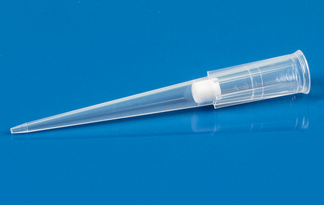

### PCR primers

We keep PCR primers in this [list](https://docs.google.com/document/d/1TfKUGfgoNLhM8fXh8LbT8TxDb_vpuViC37C-xepqJY8/edit?usp=sharing).

The PCR primer stocks are dissolved to a final concentration of 100 µM when they arrive.
This is done by looking at the synthesis report, where the volume necessary to dissolve to 100 pmol/µL
is listed (see orange circles below). 100 µM is equivalent to 100 pmol/µL.

**Always** use filtered tips to dissolve the primer stocks in [[ddH2O]].

**Never use the primer stocks directly.**

Dilute PCR primers to 10 µM working solutions.

**Always** use filtered tips when pipetting from primer stocks.
You can use normal tips for the [[ddH2O]] used to dilute the primers.

Mark the tubes with 10 µM primer with the PCR primer number and keep it in the fridge.

Do not dilute more primer than necessary, usually 100 to 200 µL is more than enough.
