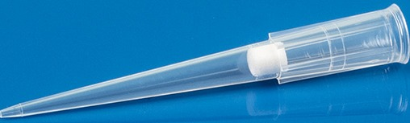

### Using PCR primers

We keep PCR primers in this [Google Doc](https://docs.google.com/document/d/1TfKUGfgoNLhM8fXh8LbT8TxDb_vpuViC37C-xepqJY8/edit?usp=sharing). Access is required, ask for it if you do not have it.

### Designing PCR primers

<https://www.primer3plus.com>

### Buying PCR primers

As of April 1 2026, these options are the best offerings from Eurofins:

| Size    | Product                               |
| ------- | ------------------------------------- |
| 10..33  | SaltFree Oligo NightXpress €0.29/base |
| 34..35  | PCR Primer in Tubes = €9.90           |
| 36..120 | Custom DNA Oligos in Tubes            |

### Receiving primers

We normally buy lyophilized (freeze-dried) primers. This is a good option in terms of high stability during shipping. This means that you have to reconstitute (dissolve or dilute) the dried primers with water. The PCR primer stocks should be reconstituted to a final concentration of **100 pmol/µL** (equivalent to 100µM). Eurofins provide a volume to add to the primer (see orange ring in the figure below).

1. **Always** use filtered tips to dissolve the primer stocks in [[ddH2O]] (ultrapure).
2. **Always** use filtered tips when pipetting from primer stocks.
3. **Never use the primer stocks directly.** Dilute PCR primers to 10 µM working solutions (You can use normal tips for the [[ddH2O]] used to dilute the primers.)
4. Mark the tubes with 10 µM primer with the **PCR primer number** and keep it in the fridge.
5. Do not dilute more primer than necessary, usually 100 to 200 µL is more than enough.

![[primer_dilutions.png]]

